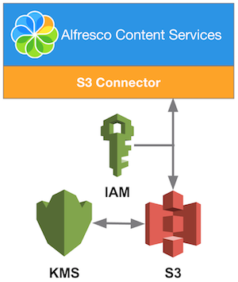

# Alfresco Content Connector for AWS S3 2.1

The Alfresco Content Connector for AWS S3 is an add-on module that provides an alternative content store. It uses Amazon's Simple Storage Service \(S3\) as the storage mechanism for Alfresco Content Services, allowing for virtually unlimited and inexpensive storage.

Here is a summary of the key capabilities introduced in 2.1:

-   Support for AWS S3 for on-premises installation of Alfresco Content Services
-   [AWS S3 Standard - Infrequent Access \(S3 IA\) storage class](https://aws.amazon.com/s3/storage-classes/) support

Key capabilities introduced in 2.0:

-   Refactored to use AWS SDK instead of old JetS3t libraries as it's less error prone
-   [AWS Identity and Access Management \(IAM\)](https://aws.amazon.com/iam/) support
-   [AWS Key Management Service \(KMS\)](https://aws.amazon.com/kms/) support
-   Storage path approach optimized for high-throughput reads and writes
-   Handling incomplete multipart uploads abort

The AWS SDK provides better support, stability, and extensibility for developers, and is more actively maintained.

**Important:** The S3 Connector 2.1 module can be applied to Alfresco One 5.1.x, and Alfresco Content Services 5.2 or later.

**Important:** To leverage the full capabilities, it's recommended to run your Alfresco Content Services instance on Amazon's Elastic Compute Cloud \(EC2\), connected to Amazon's Simple Storage Service \(S3\). From S3 Connector 2.1 you can now also use the S3 Connector with an Alfresco Content Services instance running on-premises, with [some limitations](s3-contentstore-onprem-config.md#onprem-limitations). Other devices or services that advertise as being S3 compatible have not been tested and aren't supported.

The following diagram shows a simple representation of how Alfresco Content Services and the S3 Connector interact with AWS S3.

For earlier releases of the S3 Connector, see the **Previous versions** section of [https://docs.alfresco.com](https://docs.alfresco.com).

-   **[Installing and configuring the S3 Connector](../concepts/s3-contentstore-install-intro.md)**  
Use this information to install and configure S3 Connector as an alternative content store.
-   **[Upgrading the S3 Connector](../tasks/s3-contentstore-upgrade.md)**  
Use this information to upgrade the S3 Connector from a previous version \(such as 1.3.x\) to 2.x.
-   **[S3 Connector FAQs](../references/s3-contentstore-faq.md)**  
Here are the answers to some frequently asked questions about S3 Connector 2.1.
-   **[Copyright](../reuse/copyright.md)**  

-   **[Disclaimer](../reuse/disclaimer.md)**  

