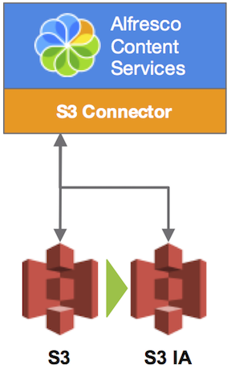

# Configuring AWS Storage Classes

Use this information to configure S3 Connector for infrequent access to objects stored in AWS S3.

Objects in AWS S3 can be stored under several storage classes during an object's lifetime, such as Standard and Standard - Infrequent Access \(Standard-IA\).

-   **Standard**

    This is the default storage class for objects uploaded to AWS S3, and should be used for frequently accessed data.

-   **Standard-IA**

    Content should be changed to Standard-IA, or S3 IA, when it's less frequently used. For example, this may be useful for archiving or storing old data that is less likely to be accessed, as this may reduce storage costs. See [Amazon S3 Storage Classes](https://docs.aws.amazon.com/AmazonS3/latest/dev/storage-class-intro.html) and [Amazon S3 Pricing](https://aws.amazon.com/s3/pricing/) for more.

The transition of content from S3 to S3 IA is configured through the AWS console. You can change an object's storage class either manually or by adding a lifecycle policy for an S3 bucket. See [Creating a Lifecycle Policy](https://docs.aws.amazon.com/AmazonS3/latest/user-guide/create-lifecycle.html) for more.

You can use S3 storage class analysis to fine tune the lifecycle rules according to your storage access patterns, so that the right data is transitioned to Standard-IA storage class. See [Amazon S3 Storage Class Analysis](https://docs.aws.amazon.com/AmazonS3/latest/dev/analytics-storage-class.html) for more.

**Conditions for changing storage class to Standard-IA**

Before transitioning objects to Standard-IA, consider the following limitations:

-   The minimum retention period required before an object can be changed to Standard-IA is 30 days.
-   The minimum object size is 128KB.

**Note:** When using the S3 Connector, new versions of a document are stored using the Standard storage class by default.

**Important:** The S3 Connector doesn't support transitioning to the Glacier storage class.

Here are some example scenarios to help you consider if using storage classes is right for your environment:

1.  Collaboration: On an S3 bucket with frequently used content as part of any current work.
    -   Create a lifecycle rule for content older than **365 days** to be moved to Standard-IA, as part of the aging process.
2.  Document Archiving: On an S3 bucket with content that's known to be archival content.
    -   Create a lifecycle rule for content older than **30 days** to be moved to Standard-IA.

The following diagram shows a simple representation of how Alfresco Content Services and the S3 Connector interact with AWS S3, when using the default Standard storage class and transitioning content to Standard-IA \(S3 IA\).

**Parent topic:**[Configuring the S3 Connector](../tasks/s3-contentstore-config.md)

