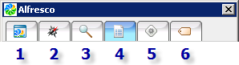

# Accessing the Microsoft Office Add-In

The Microsoft Office Add-In starts automatically when Microsoft Word starts.

If you cannot see the panel, click the **Alfresco** button on the Word toolbar: 

The **Alfresco** panel consists of six tabs:

-   **1. My Alfresco**

    The My Alfresco tab displays the documents you currently have checked out \(working copies\); all tasks currently assigned to you, in ascending order of due date; and a list of available actions.

-   **2. Browse Spaces and Documents**

    The Browse Spaces and Documents tab displays the current space; the subspaces for the current space; a list of the documents and files contained within the current space; and a list of available actions.

-   **3. Search Alfresco**

    The Search Alfresco tab enables you to search for spaces and files.

-   **4. Document Details**

    The Document Details tab displays information on the currently open document, including document metadata and a version history. As on the previous tabs, a list of available actions is also displayed.

-   **5. My Tasks**

    The My Tasks tab has dual functionality: you can use it to view an existing task or to start a new workflow on an existing document. In both cases, the **My Tasks** list displays the tasks assigned to you, organized by due date. Beneath this list you will either view and manage the selected task, or enter the details of the new workflow.

-   **6. Document Tags**

    The Document Tags tab displays all tags associated with documents in Alfresco. You can then view a list of documents associated with a specific tag.

Some tabs contain expandable panels, indicated by the  icon. Click the icon to expand the panel and click it again, now displayed as , to restore it.

**Parent topic:**[Using the Microsoft Office Add-In](../concepts/MSAddin-using.md)

