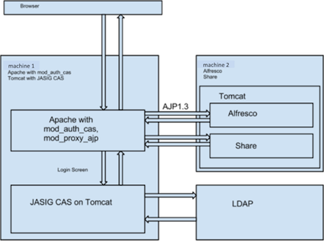

# Overview of using Alfresco with CAS authentication

This topic describes the configuration necessary to enable Alfresco to work with Jasig CAS authentication through Apache `mod_auth_cas`.

As shown in the diagram below, the approach uses two separate machines: machine 1, the SSO server, with Apache and CAS on Tomcat and machine 2, the Alfresco server with its own Tomcat containing the Alfresco and Share web applications.

**Parent topic:**[Using Alfresco with CAS authentication through Apache mod\_auth\_cas](../concepts/alf-modauthcas-home.md)

