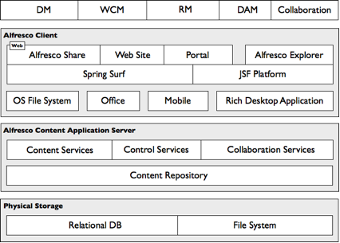

# Architecture

There are many ways to slice and deploy Alfresco, however most deployments follow a general pattern. Ultimately, Alfresco is used to implement ECM solutions, such as Document Management \(DM\), Web Content Management \(WCM\), Records Management \(RM\), and Digital Asset Management \(DAM\). Across those solutions may also be elements of collaboration and search.

The solutions are typically split between clients and server, where clients offer users a user interface to the solution and the server provides content management services and storage. Solutions commonly offer multiple clients against a shared server, where each client is tailored for the environment in which it is used.

The following figure shows various architectural components.

## Clients

Alfresco offers two primary web-based clients, Alfresco Explorer and Alfresco Share.

-   Alfresco Explorer is deployed as part of the Alfresco content application server. It is a highly customizable power-user client that exposes all features of the Alfresco content application server and is implemented using Java Server Faces \(JSF\).
-   Alfresco Share can be deployed to its own tier separate from the Alfresco content application server and managed through the Alfresco WCM solution. Alfresco Share focuses on the collaboration aspects of content management and streamlining the user experience. Alfresco Share is implemented using Spring Surf and can be customized without JSF knowledge.

Clients also exist for portals \(via JSR-168 portlets\), mobile platforms, Microsoft Office, and the desktop. A client often overlooked is the folder drive of the operating system, where users share documents through a network drive. Using JLAN technology, Alfresco can look and act just like a folder drive. JLAN is the only Java server-side implementation of the CIFS protocol, letting users interact with Alfresco as they do any other normal file drive except the content is now stored and managed in the Alfresco content application server.

## Server

The Alfresco content application server comprises a content repository and value-added services for building ECM solutions. Two standards define the content repository: CMIS \(Content Management Interoperability Services\) and JCR \(Java Content Repository / JSR-170/286\). These standards provide a specification for content definition and storage, content retrieval, versioning, and permissions. Complying with these standards provides a reliable, scalable, and efficient implementation.

The Alfresco content application server provides the following categories of services built upon the content repository:

-   Content services \(transformation, tagging, metadata extraction\)
-   Control services \(workflow, records management, change sets\)
-   Collaboration services \(social graph, activities, wiki\)

Clients communicate with the Alfresco content application server and its services through numerous supported protocols. HTTP and SOAP offer programmatic access while CIFS, FTP, WebDAV, IMAP, and Microsoft SharePoint protocols offer application access. The Alfresco installer provides an out-of-the-box prepackaged deployment where the Alfresco content application server \(with embedded Alfresco Explorer\) and Alfresco Share are deployed as distinct web applications inside Apache Tomcat.

-   **[Alfresco content application server](../concepts/content-server-about.md)**  
At the heart of the Alfresco system is the content application server, which manages and maintains the content repository. The server's primary responsibility is to provide services for use in building ECM solutions. All the applications of the Alfresco ECM suite are built upon and executed by the content application server.
-   **[Alfresco content repository](../concepts/content-repo-about.md)**  
The content repository is comparable to a database, except that it holds more than data. The binary streams of content are stored in the repository and the associated full-text indexes are maintained by the Lucene indexes.
-   **[Alfresco content services](../concepts/serv-about.md)**  
 Services address the core use cases for content management applications including the logical organization of content, file management, version control, and security. Services also support the control of content through workflow and process management, and social and collaborative applications.
-   **[APIs](../concepts/api-about.md)**  
To access and extend Alfresco out-of-the-box services, the Alfresco content application server exposes two flavors of API, each designed for a specific type of client.
-   **[Content modeling](../concepts/content-modeling-about.md)**  
Content modeling is a fundamental building block of the Alfresco content repository that provides a foundation for structuring and working with content.
-   **[Protocols](../concepts/protocols-about.md)**  
 The Alfresco content application server supports many folder and document-based protocols to access and manage content held within the content repository using familiar client tools.
-   **[Modularity](../concepts/spring-fw-modularity.md)**  
The Alfresco system is modular. Every moving part is encapsulated as a service, where each service provides an external face in a formally defined interface and has one or more black-box implementations.
-   **[Alfresco web application framework](../concepts/web-app-framework.md)**  
Alfresco Share and all new Alfresco web applications are built on Spring Surf. This web application framework provides the typical features of this kind of framework and supports web content management needs.
-   **[Deployment options](../concepts/deploy-options.md)**  
You can deploy Alfresco in many different forms and topologies. Because its infrastructure foundation protects Alfresco from the environment within which it executes, you can choose components such as operating system, database, application server, web browser, and authentication system. Alfresco is designed to scale down as well as up.

**Parent topic:**[Overview](../concepts/system-about.md)

