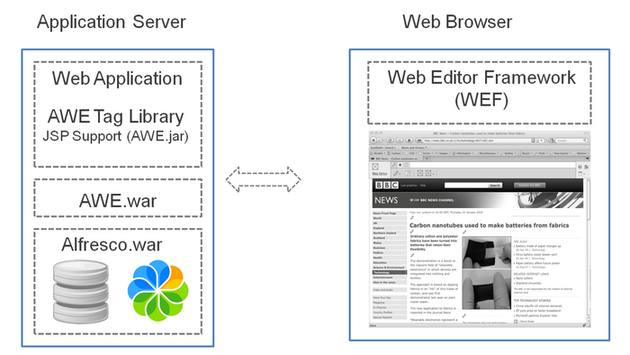

# Alfresco Web Editor deployment

The simplest way to deploy the Alfresco Web Editor \(AWE\) is to use the pre-built WAR \(awe.war\) file and to deploy it in the same application server instance of your web application.

The following diagram shows an example Alfresco Web Editor deployment in the same application server as the Alfresco repository.



The Alfresco Web Editor is a Spring Surf-based application, therefore it is also possible to deploy it in a different application server instance from the Alfresco repository.

By default the AWE assumes your Alfresco repository is at `http://localhost:8080/alfresco/s/`. If your repository is not located here, you can use custom configuration to tell the AWE where to find your repository. To change the default repository location, add the following XML in the AWE configuration file with your values for **MYSERVER** and **MYPORT**:

```


<alfresco-config> 
   <plug-ins> 
      <element-readers> 
         <element-reader element-name="remote" class="org.springframework.extensions.config.RemoteConfigElementReader" /> 
      </element-readers> 
   </plug-ins> 

   <config evaluator="string-compare" condition="Remote"> 
      <remote> 
         <endpoint> 
            <id>alfresco</id> 
            <name>Alfresco - user access</name> 
            <description>Access to Alfresco Repository WebScripts that require user authentication</description> 
            <connector-id>alfresco</connector-id> 
            <endpoint-url>http://MYSERVER:MYPORT/alfresco/s 
            </endpoint-url> 
            <identity>user</identity> 
         </endpoint> 
      </remote> 
   </config> 
</alfresco-config> 


```

The AWE configuration file is placed on the classpath named shared/classes/alfresco/web-extension/awe-config-custom.xml.

The deployment comprises the following components:

-   **AWE.war**

    The Alfresco Web Editor WAR file.

-   **Web Application**

    Your own web application.

-   **AWE tag library**

    Provides the ability to mark areas of the page as editable. The areas marked can represent any property or content from the Alfresco repository.

-   **Web Editor Framework \(WEF\)**

    The client-side JavaScript framework on which the Web Editor is built. It is built using YUI and can be extended easily. New tabs and buttons can be packaged and dropped into the framework. This provides the core Alfresco product features, and also provides the ability to build additional custom plugins.

    When the Alfresco Web Editor is enabled, the WEF renders the tool bar and basic in-context editing buttons and functionality. If the WEF is deployed as standalone, the default blank tool bar is rendered.


-   **[Deploying the Alfresco Web Editor](../tasks/awe-depoy.md)**  
The Alfresco Web Editor distribution consists of a single zip file named alfresco-enterprise-webeditor-3.4.14.zip.
-   **[Deploying the Alfresco Web Editor to a Spring Surf application](../tasks/awe-depoly-springsurf.md)**  
The Alfresco Web Editor distribution also includes all the files required to provide the functionality within an existing Spring Surf application.

**Parent topic:**[Alfresco Web Editor](../concepts/awe-intro.md)

