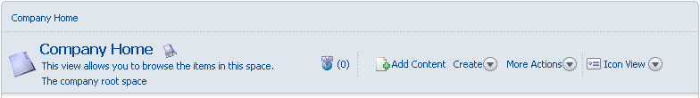

# Working area

The working area is a dynamic area displaying items relevant to the task you are performing.

The working area changes depending on the information you are looking at or the task you are performing. The top of the working area always displays a navigation breadcrumb that allows you to jump to any part of the breadcrumb path. For information views, there is a summary area along with actions or alternative views. The details and options also change depending on what you are looking at and doing, as well as who you are.

**Parent topic:**[Starting with Explorer](../concepts/cgs-starting.md)

