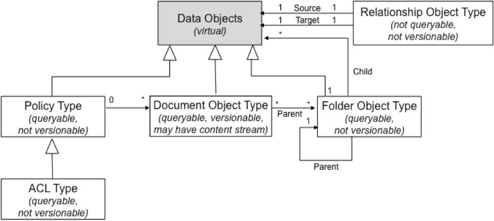
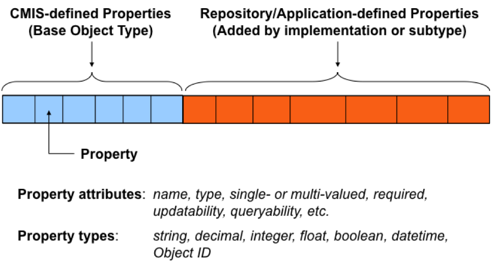
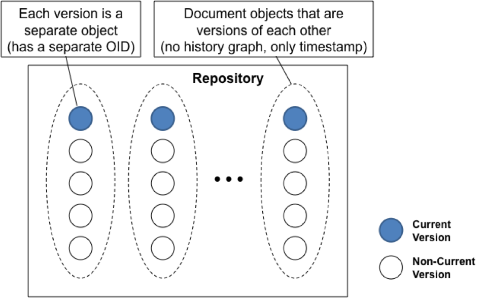
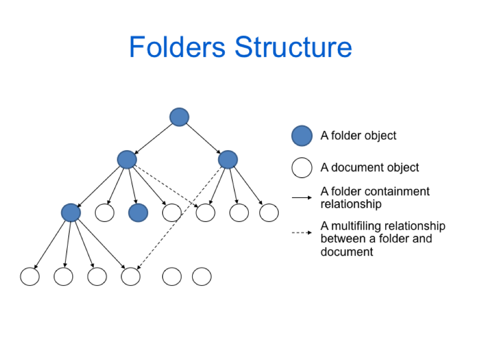

# CMIS object model

The CMIS object model is similar to the Alfresco object model minus the support of aspects. It supports versioning, policy, document, and folder objects.

CMIS supports object types that define properties associated with each type. Each object has an object type, properties defined by that object type, and an object ID.

Object types support inheritance and are sub-typed as document object types and folder object types. Document object types may have content streams to store and access binary data. Object types may also be related through relationship object types.

**Parent topic:**[Building applications with Content Management Interoperability Services \(CMIS\)](../concepts/cmis-about.md)

## CMIS policy object

A policy object represents an administrative policy that can be enforced by a repository, such as a retention management policy.

An Access Control List is a type of policy object. CMIS allows applications to create or apply ACLs. The Alfresco repository also uses policy objects to apply aspects.

## CMIS document object

Document objects have properties and content streams for accessing the binary information that is the document, properties that may be multi-valued, and versions.

Document objects can also have renditions that represent alternate file types of the document. Only one rendition type, a thumbnail, is well defined.

## CMIS versioning

Versioning in CMIS is relatively simple to encompass the various versioning models of different CMIS implementations.

Each version is a separate object with its own object ID. For a given object ID, you can retrieve the specific version, the current version, or all versions of the object, as well as delete specific or all versions of a Document object. Document versions are accessed as a set of Document objects organized on the time stamp of the object. CMIS does not provide a history graph.

## CMIS folder object

Document objects live in a folder hierarchy. As in Alfresco, a folder can exist in another folder to create the hierarchy. The relationship between folder and document is many-to-many if the repository supports multi-filing, allowing a document to appear in more than one folder. Otherwise, it is one-to-many.

