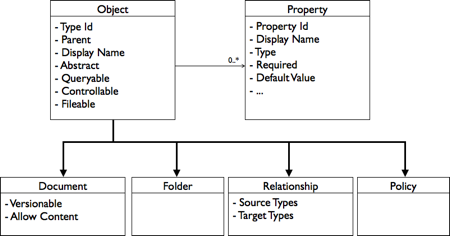

# Alfresco content models and CMIS

CMIS defines a data model, which encapsulates the core concepts found in most content repositories. Alfresco provides an implementation of the CMIS bindings and maps the Alfresco content metamodel to the CMIS domain model. This allows content models defined in Alfresco to be exposed and manipulated via CMIS.

The following summarizes the CMIS data model:

The core of the domain model allows for the definition of object types with associated properties. A type ID identifies types, which may inherit their definition from a parent type. Features of a type include whether they can be queried by the CMIS query language, filed into multiple folders, and controlled via permissions. Features of a property include its data type, whether a value is required, and a default value if one is not explicitly provided.

Because these features are familiar, you can map between the CMIS data model and the Alfresco content metamodel with little loss of information.

The Alfresco content metamodel is mapped to the CMIS data model as follows:

-   **Type**—Maps to CMIS Object Type
-   **Property**—Maps to CMIS Property Definition
-   **Peer Association**—Maps to CMIS Relationship

## Mapping child associations

CMIS has built-in support for hierarchies through CMIS Folder and CMIS Document.

Alfresco maps its out-of-the-box types `cm:folder` and `cm:content` \(as defined in the Alfresco ECM domain model\) to CMIS Folder and CMIS Document, respectively. A folder may contain a mixture of documents and folders, allowing for a hierarchy of documents to be built. Through this, CMIS supports an implicit notion of parent to child, to which Alfresco maps its child association. Subtypes of `cm:folder` and `cm:content` are exposed as subtypes of CMIS Folder and Document, respectively.

**Parent topic:**[Content modeling](../concepts/content-modeling-about.md)

