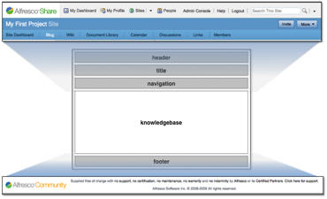

# Configuring custom site pages

Alfresco Share comes with several site pages out of the box. When Alfresco Share starts up, it looks to its own configuration file to determine which site pages have been set up and how to identify them.

A default installation might include the following configuration for Alfresco Share:

```
<config evaluator="string-compare" condition="SitePages"> 
  <pages> 
    <page id="calendar">calendar</page> 
    <page id="wiki-page">wiki-page?title=Main_Page</page> 
    <page id="documentlibrary">documentlibrary</page> 
    <page id="discussions-topiclist">discussions-topiclist</page> 
    <page id="blog-postlist">blog-postlist</page> 
    <page id="links">links</page> 
    <page id="tasks">tasks</page> 
  </pages> 
</config>
```

Each `<page>` element has an ID that defines the ID of the page in Spring Surf. The value of the `<page>` element provides information the Spring Surf components on the page will use to look up the page content. To define your own custom site page, develop a Spring Surf page and add it to the Alfresco Share configuration.

Building a new site page for Alfresco Share is easier than building a page from scratch because you can reuse much of the existing application user interface.

The following example is a template for a Knowledge Base page consisting of five regions \(header, title, navigation, knowledgebase, and footer\):



Four of these regions have reuseable components provided out of the box. By reusing the header, the title section, the navigation controls, and the footer, you can quickly inherit a consistent look and feel with the rest of the application. You can put something into the knowledgebase region in the middle.

-   **[Adding Knowledge Base site components](../concepts/site-component-add.md)**  
Adding something to the knowledgebase region of the page involves building a Surf component and binding it to the region for it to render in that spot. You do this by writing a web script, which consists of a few simple files on disk that implement things like scriptable controllers and template views. Alfresco Share picks them up without the need for a server restart or recompilation.
-   **[Designing for browser dependencies](../tasks/kb-browser-config.md)**  
A web script requires a descriptor file, a scriptable controller, and template view, but you can also define extra elements. A dashlet can render HTML compliant markup and allow the Alfresco Share framework to assert the proper CSS used to decorate the dashlet. However, if a dashlet wants to use CSS includes or browser-side JavaScript, it must inform the web framework to inject specific dependencies into the HTML `<head>` tag. Spring Surf lets your web scripts declare these kinds of dependencies.
-   **[Configuring for Internationalization](../tasks/kb-I18n-config.md)**  
Internationalization \(often abbreviated I18N\) means that your dashlet is mindful of the current user’s language and locale settings so that, for example, the dashlet renders in Spanish for Spanish speakers and in French for French speakers. It is good practice to design your site’s page components to enable them to work for multiple locales. Custom dashlets can use message bundles to enable Internationalization.
-   **[Configuring Alfresco Share](../tasks/kb-custom-page-declare.md)**  
Once you have built your page, you must declare it available to Alfresco Share through the Alfresco Share configuration file.
-   **[Defining custom site presets](../tasks/kb-preset-create.md)**  
The Create Site wizard in Alfresco Share lets you quickly create and configure new sites. The *Collaboration Site* is available by default. When you create this type of site, Alfresco Share automatically creates your site space and pre-configures the site with pages and site dashboard components. You can configure the default options for the Collaboration Site through Alfresco Share configuration files.
-   **[Overriding the default message bundle](../concepts/kb-preset-internationalization.md)**  
To quickly provision your site for many different countries and languages, you can provide a message bundle for the Alfresco Share configuration. To do so, you need to wire in your own message bundle to Alfresco Share that overrides Alfresco Share’s default message bundle values.

**Parent topic:**[Customizing Alfresco Share \(basic\)](../concepts/kb-share-customize-about.md)

