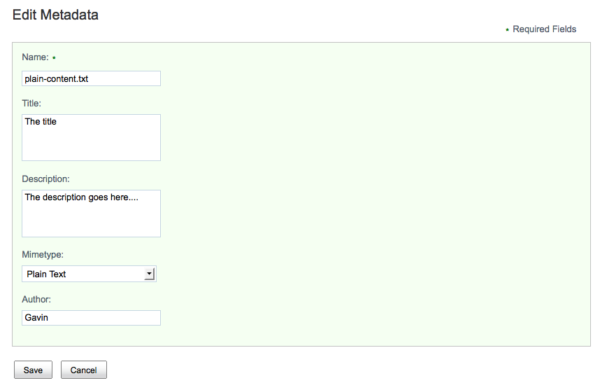

# Use of forms in Share

Forms are used in the View Metadata and Edit Metadata pages within Share.

The following screen shot shows the form component on the Edit Metadata page.

The content of the form is completely driven from configuration custom types, custom aspects. Their properties and associations can be displayed within Share.

**Parent topic:**[Forms](../concepts/forms-intro.md)

