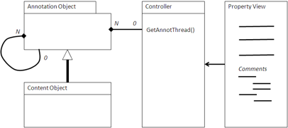

# Annotation

An annotation is a piece of user-generated content that annotates an object \(usually a document, web page, or article\) with information or comments regarding that object.

Annotations themselves can be annotated, leading to a threaded trail of discussion. Annotations provide end users with the opportunity to comment on the quality, intent, or accuracy of the document, which improves the document, making annotations a good way to capture user-generated content for a website or Web 2.0 application.

Annotations can be put in the context of a specific location on a page or can trail the document at the end, appearing to be part of the metadata of the document. Threaded annotation discussions are best kept separate from the content. However, an annotation placed in situ in the document must be done in conjunction with either a desktop-based or rich client-based editor, such as those associated with PDF or Computer Aided Design \(CAD\) tools.



## Using an Annotation

The application presents a simple form to capture the comment about the content. This is usually done in the Property view. This form is normally either plain text or restricted HTML limited to only basic formatting. The application creates the content as type Annotation and creates an association between the annotation and the document. If the annotation is threaded, an association is also made to the annotation to which this annotation is referring.

Once stored, the Property view regenerates the form view or uses AJAX to append the new annotation. The new annotation is placed at the end of the annotations if the preferred order is chronological or after the annotation if this is an annotation of an annotation.

## When to use an Annotation

Annotations are important for collaborative applications as they provide an important part of the feedback loop on the quality of content and presentation of a document or article. They are also useful for engaging the user and become an important part of the usability of the application.

## Example: Comments in an Alfresco Share blog

The following is an example of annotations with comments in a blog in Alfresco Share. In this case, these are the comments at the end of the blog and are handled by the FreeMarker template comments.get.html.ftl. This is included in the same page as the blogs using Surf regions. This lists the comments attached to a blog. Most of the setup is for layout within Surf, but the core of the functionality is at the end.

```
 <script type="text/javascript">//
<![CDATA[
  new Alfresco.CommentList("${args.htmlid}").setOptions({
    siteId: "${page.url.templateArgs.site!""}",
    containerId: "${template.properties.container!"blog"}",
    height: ${args.editorHeight!180},
    width: ${args.editorWidth!700},
    editorConfig: {
      height: ${args.editorHeight!180},
      width: ${args.editorWidth!700},
      theme: 'advanced',
      theme_advanced_buttons1:
      "bold,italic,underline,|,bullist,numlist,|\
,forecolor,backcolor,|,undo,redo,removeformat",
      theme_advanced_toolbar_location: "top",
      theme_advanced_toolbar_align: "left",
      theme_advanced_statusbar_location: "bottom",
      theme_advanced_resizing: true,
      theme_advanced_buttons2: null,
      theme_advanced_buttons3: null,
      theme_advanced_path: false,
      language: '${locale?substring(0, 2)}'
      }      
    }).setMessages(${messages});
//]]>
</script>
<div id="${args.htmlid}-body" class="comment-list" style="display:none;">
  <div class="postlist-infobar">
    <div id="${args.htmlid}-title" class="commentsListTitle"></div>
    <div id="${args.htmlid}-paginator" class="paginator"></div>
  </div>
  <div class="clear"></div>
  <div id="${args.htmlid}-comments"></div>
</div>
```

There is a link in the Comments section that invokes the web script implemented by createcomment.get.html.ftl. This presents a special view to capture the comment and add it to the repository.

```
<script type="text/javascript">//<![CDATA[
  new Alfresco.CreateComment("${args.htmlid}").setOptions(
  {
    siteId: "${page.url.templateArgs.site!""}",
    containerId: "${template.properties.container!"blog"}",
    height: ${args.editorHeight!250},
    width: ${args.editorWidth!538},
    editorConfig : {
      height: ${args.editorHeight!250},
      width: ${args.editorWidth!538},
      theme: 'advanced',
      theme_advanced_buttons1:
          "bold,italic,underline,|,bullist,numlist,|,\
forecolor,backcolor,|,undo,redo,removeformat",
      theme_advanced_toolbar_location: "top",
      theme_advanced_toolbar_align: "left",
      theme_advanced_statusbar_location: "bottom",
      theme_advanced_resizing: true,
      theme_advanced_buttons2: null,
      theme_advanced_buttons3: null,
      theme_advanced_path: false,
      language: '${locale?substring(0, 2)}'         
    }
   }).setMessages(${messages});
//]]></script>

<div id="${args.htmlid}-form-container" class="addCommentForm hidden">
  <div class="commentFormTitle">
    <label for="${htmlid}-content">${msg("addComment")}:</label>
  </div>
  <div class="editComment">
    <form id="${htmlid}-form" method="post" action="">
      <div>
        <input type="hidden" id="${args.htmlid}-nodeRef" name="nodeRef" value="" />
        <input type="hidden" id="${args.htmlid}-site" name="site" value="" />
        <input type="hidden" id="${args.htmlid}-container" name="container"
             value="" />
        <input type="hidden" id="${args.htmlid}-itemTitle" name="itemTitle"
             value="" />
        <input type="hidden" id="${args.htmlid}-page" name="page" value="" />


        <input type="hidden" id="${args.htmlid}-pageParams"
             name="pageParams" value=""/>

        <textarea id="${htmlid}-content" rows="8" cols="80" name="content">
        </textarea>
      </div>
      <div class="commentFormAction">
        <input type="submit" id="${htmlid}-submit" value="${msg('postComment')}"/>
      </div>
    </form>
  </div>
</div>
```

The code here is the presentation layer using Surf to present a list of comments and then to capture a comment from a user. There are calls to set up the theme for the forms, but the main part in both is to use div classes to set up the presentation of the list or form. In the first part, Surf is used to present the list of comments associated with `htmlid` of the object to which the comments are attached. In the second part, a comment is captured using an HTML form and posted to the object identified by `htmlid`.

**Parent topic:**[Content management integration patterns](../concepts/integration-patterns.md)

