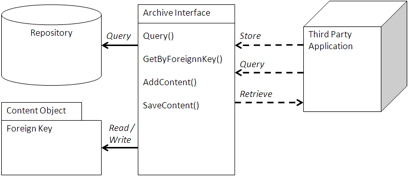

# Archive

An Archive is a repository for the long-term storage and control of information that must be retained for operational or regulatory reasons.

Typical uses for an archive are to store reports, scanned documents, or electronic documents that are no longer used, but which the organization wishes to retain for possible future use. Records are a special case of Archive in which the documents and content stored in the archive are managed according to official rules of retention, lifecycle, and/or review process.



## Using an Archive

An archive is usually a section of an Alfresco repository that has a separate folder/space structure specifically for the documents stored in the archive. An archive will specify permission controls on who can add, modify, or delete documents. An archive also provides lifecycles on change of state and location.

The Alfresco Records Management module provides even more sophisticated controls over security and retention. File Plans are associated with folders, which can determine how long records will be retained and what happens to the record after retention: is it destroyed or transferred, how often must it be reviewed, and what events change the state of the record. If the application chooses to use the Records Management option, it should either be responsible for filing the records and adding all mandatory information, or it should direct the user or records manager to the Records Management application to process the record.

Most applications integrating an archive use it to store captured or generated information from the application. The application may also use the archive to store attachments that are part of a business process. Therefore, an archive usually works in cooperation with attachments. There is usually enough information in the application to allow the application to decide where to store the information in the archive. In addition, the application should be responsible for generating the Foreign Key to allow retrieval and association of the document in the archive.

Since many applications use the file system to store their output, using the CIFS, NFS, or WebDAV interface may be an alternative way to store and access the documents in the archive. Most email clients support IMAP, so Alfresco’s IMAP interface can act as an archive for email. This can be a very simple way to integrate content into a repository, although it will not be able to capture as much metadata as a direct connection. For email, there may be enough information in the From, To, and Subject fields to extract and classify emails going into an archive. The application would be dependent upon rules, actions, and metadata extraction to fill in default information. By associating a workflow with a folder through a rule, Alfresco could forward the document for further metadata entry.

A separate Query view may be generated to present an application-specific view of the documents in the archive based upon context in the application. For instance, if an application was archiving reports based upon a specific portion of that application, then the application would provide a view of those reports that may be independent of where they are stored. It may also provide context, status, and process information that are specific to that application. Alternatively, an application could use a URL link to a specialized Share view or portlet.Because an archive is used for long-term storage, a separate content store may be used for Hierarchical Storage Management system or secondary storage. This can be controlled by the application by applying a special aspect that determines into which store the content will go.

## When to use an Archive

Scanning applications are a very common use of archives. Paper documents are scanned to simplify their retrieval and use in electronic business processes. They are also stored to ensure their long-term retention.

Very simple scanning interfaces can use the file system emulation to store content in the archive. More sophisticated scanning applications, such as Kofax, use repository-specific release scripts that capture and load metadata into the archive.

Enterprise Resource Planning and Customer Relationship Management applications, such as SAP and Oracle, use Service Provider Interfaces \(SPI\) for storing reports and archiving data. SAP’s ArchiveLink interface was one of the first of its kind to standardize and certify interfaces for archiving. Similar applications that are very process and report heavy are also good candidates for an archive.

General clearing and retention of documents and emails are other good candidates for an archive. Email clients can use an archive with the IMAP protocol to drag and drop or use email rules to archive old emails. By presenting the archive as a shared drive, it is easy to move content off and still make it accessible.

Records in either governmental or regulatory use can also use an archive with the Records Management module. Documents, reports, and scanned documents all represent potential records in an archive backed by the Records repository.

## Example: Kofax Release Script

Microstrategies, Inc. \(www.microstrategies.com\)created a Kofax release script that is a standard way to integrate to the Kofax scanning system \(www.kofax.com\). Kofax is a high-end, high-volume image scanning system that works with multiple content repositories, and a release script is the standard way to capture metadata and store the content and metadata into a content repository.

In this instance, the release script is written in C\# and .NET to integrate with the Kofax client and uses web scripts to access the Alfresco repository. This file, `AlfrescoRelease.cs`, uploads the images as documents and hooks into standard Kofax integration points.

```
 /// <summary>
/// The Release URL for Alfresco: This is the URL used to post documents
/// to Alfresco. 
/// It uses a ticket for authentication. For example:
/// <code>
/// /service/kofax/release?alf_ticket={0}
/// </code>
/// </summary>
public string ReleaseURL
{
  get { return releaseURL; }
  set { releaseURL = value; }
}

/// <summary>
/// Releases documents to Alfresco: Retrieves all document and metadata information
/// from Kofax and inserts it into Alfresco.
/// </summary>
/// <returns>A KfxReturnValue object detailing if the release was successful
/// </returns>
public KfxReturnValue release()
{
  try
  {
    int uniqueDocumentID = this.releaseData.UniqueDocumentID;
    CustomProperties properties = this.releaseData.CustomProperties;
    initializeCustomProperties(properties);
    initializeWorkingFolders(uniqueDocumentID);

    string response = uploadDocuments();

    //Process Result
    if (response.StartsWith("ERROR"))
    {
      logger.Error(response);
      this.releaseData.SendMessage(response, 9999,
          KfxInfoReturnValue.KFX_REL_DOC_ERROR);
      error.LogError(response, "Alfresco.Kofax.Release.WebScripts.Release",
          response, true, true, "");
      return KfxReturnValue.KFX_REL_ERROR;
    }
    else
    {
      WebStatus status = new WebStatus(response);
      int code = status.Code;
      string description = status.Description;
      string message = status.Message;
      string statusName = status.Name;

      if (message.StartsWith("ERROR"))
      {
        logger.Error(response);
        this.releaseData.SendMessage(message, 9999,
            KfxInfoReturnValue.KFX_REL_DOC_ERROR);
        error.LogError(message, "Alfresco.Kofax.Release.WebScripts.Release",
            response, true, true, "");
        return KfxReturnValue.KFX_REL_ERROR;
      }
    }
  }
}

/// <summary>
/// Uploads the documents.
/// </summary>
/// <returns></returns>

private string uploadDocuments()
{
  //Upload Documents
  string kofaxPDFFileName = this.releaseData.KofaxPDFFileName;

  string ticket = AlfrescoTicketHelper.getTicket(url + String.Format(loginURL,
      customUsername, customPassword));

  WebUpload release = new WebUpload(url + String.Format(releaseURL, ticket));
  release.addField("contentType", contentType);
  release.addField("overwrite", overwrite);
  release.addField("uploaddirectory", defaultFolder);
  if ((dynamicFolder != null) && (!dynamicFolder.Equals("")))
    release.addField("dynamicuploaddirectory", dynamicFolder);
  foreach (Value oVal in this.releaseData.Values)
  {
    string destination = oVal.Destination;
    string source = oVal.SourceName;
    string value = oVal.Value;

    if (source.Equals("Image"))
    {
      releaseData.ImageFiles.Copy(imageDirectory, 0);

      //rename move all docs to the primary release dir
      FileInfo[] files = imageDirectoryInfo.GetFiles();

      foreach (FileInfo file in files)
      {
        release.addFile(destination, file.FullName, "image/tiff");
      }
    }
  ]
]
```

This module posts the documents scanned in Kofax to Alfresco using a ticket for authentication. It collects the documents and metadata from Kofax and provides this information as part of the post. It then uploads the document as a stream. To help the release script, Kofax created the following C\# module, `WebUpload.cs`, to access the web scripts that provide the functionality in the Alfresco server needed to process the documents.

```
namespace Alfresco.Kofax.Release.WebScripts
{
  public class WebUpload
  {
    private string boundary;
    private HttpWebRequest httpWebRequest;
    private Stream requestStream;
    private FileStream fileStream;
    private Hashtable fields;
    private static readonly ILog logger = LogManager.GetLogger(typeof(WebUpload));

    public WebUpload(string url)
    {
      // Create a boundary
      boundary = "----------------------------" + DateTime.Now.Ticks.ToString("x");

      // Create the web request
      httpWebRequest = (HttpWebRequest)WebRequest.Create(url);
      httpWebRequest.ContentType = "multipart/form-data; boundary=" + boundary;
      httpWebRequest.Method = "POST";
      httpWebRequest.KeepAlive = true;
      fields = new Hashtable();
    }

    public string upload()
    {
      string responseString = "";
      try
      {
        //Add Fields to Stream - Content should already be added.
        addFieldsToStream();

        // Get the boundary in bytes
        byte[] boundarybytes = System.Text.Encoding.ASCII
                .GetBytes("\r\n--" + boundary + "--\r\n");

        // Write out the trailing boundary
        requestStream.Write(boundarybytes, 0, boundarybytes.Length);

        // Close the request and file stream
        requestStream.Close();
        fileStream.Close();

        WebResponse webResponse = httpWebRequest.GetResponse();
        Stream responseStream = webResponse.GetResponseStream();
        StreamReader responseReader = new StreamReader(responseStream);
        responseString = responseReader.ReadToEnd();

        // Close response object.
        webResponse.Close();
      }
      catch (WebException e)
      {
        if (e.Status == WebExceptionStatus.ProtocolError)
        {
          HttpWebResponse response = ((HttpWebResponse)e.Response);
          string text;
          try
          {
            using (Stream stream = response.GetResponseStream())
                        {
            using (StreamReader reader = new StreamReader(stream))
                            {
            text = reader.ReadToEnd();
            responseString = "ERROR: " + text;
            logger.Error(text);
          }
        }
      }
      catch (WebException ex)
      {
        logger.Error(ex.Message);
        responseString = "ERROR: " + ex.Message;
      }
    }

    return responseString;
  }

  public void addFile(string formFileName, string file, string mimeType)
  {
    // Get the boundary in bytes
    byte[] boundarybytes = System.Text.Encoding.ASCII.GetBytes("\r\n--"
          + boundary + "\r\n");

    // Get the header for the file upload
    string headerTemplate = "Content-Disposition: form-data;\
name=\"{0}\";filename=\"{1}\"\r\n Content-Type: " + mimeType + "\r\n\r\n";

    // Add the filename to the header
    string header = string.Format(headerTemplate, formFileName, file);

    //convert the header to a byte array
    byte[] headerbytes = System.Text.Encoding.UTF8.GetBytes(header);

    // Get the output stream
    requestStream = httpWebRequest.GetRequestStream();

    // Write out the starting boundary
    requestStream.Write(boundarybytes, 0, boundarybytes.Length);

    // Write the header including the filename.
    requestStream.Write(headerbytes, 0, headerbytes.Length);

    // Open up a filestream
    fileStream = new FileStream(file, FileMode.Open, FileAccess.Read);

    // Use 4096 for the buffer
    byte[] buffer = new byte[4096];

    int bytesRead = 0;
    // Loop through whole file uploading parts in a stream.
    while ((bytesRead = fileStream.Read(buffer, 0, buffer.Length)) != 0)
    {
      requestStream.Write(buffer, 0, bytesRead);
      requestStream.Flush();
    }
  }

  private void addFieldsToStream()
  {
    // Loop through all items of a Hashtable
    IDictionaryEnumerator item = fields.GetEnumerator();
    while (item.MoveNext())
    {
      addFieldToStream(item.Key.ToString(), item.Value.ToString());
    }
  }

  public void addField(string formFieldName, string value)
  {
    fields.Add(formFieldName, value);
  }

  private void addFieldToStream(string formFieldName, string value)
  {
    // Get the boundary in bytes
    byte[] boundarybytes = System.Text.Encoding.ASCII
            .GetBytes("\r\n--" + boundary + "\r\n");

    // Get the header for the file upload
    string headerTemplate = "Content-Disposition: form-data; name=\"{0}\"\r\n\r\n";

    // Add the filename to the header
    string header = string.Format(headerTemplate, formFieldName);

    //convert the header to a byte array
    byte[] headerbytes = System.Text.Encoding.UTF8.GetBytes(header);
    byte[] valuebytes = System.Text.Encoding.UTF8.GetBytes(value);

    // Get the output stream
    requestStream = httpWebRequest.GetRequestStream();

    // Write out the starting boundary
    requestStream.Write(boundarybytes, 0, boundarybytes.Length);

    // Write the header 
    requestStream.Write(headerbytes, 0, headerbytes.Length);

    // Write the value 
    requestStream.Write(valuebytes, 0, valuebytes.Length);
  }
}
```

These helper methods provide the tools for the .NET release script to add the metadata and file binaries to the HTTP request that interacts with the web script. These are used in the preceding release script example and can be valuable for any .NET application accessing a web script.

**Parent topic:**[Content management integration patterns](../concepts/integration-patterns.md)

