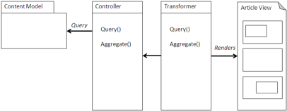
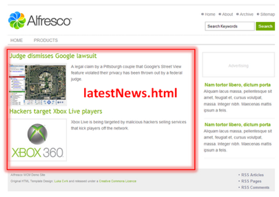

# Article

An article pattern is a single content object used in relation to the context of the application or website to present relevant and rich information to the user.

For example, the information presented may be a featured document, an explanatory piece of text, or a deeper description of a category of information. A physical article in a magazine is a good analog of a single content object or document used by the application or website to showcase new information or provide a deeper understanding of a piece of information.



## Using an Article pattern

The article is retrieved from the repository with, usually, a singleton query. This allows the article to be identified logically based upon context and to change which content will change. For instance, a tip of the day can be identified as the latest tip of the day. Avoid hard-coding any identifiers.

Set up a query with a predicate that identifies the appropriate content object. It is not necessary to retrieve any properties other than the identifier since you will have the object available for any properties. CMIS provides all the required functionality to implement access to an article and the result will be portable. However, using web scripts can be equally effective. Fetch the content object and any properties you wish to display. The title of the article may be derived from the title property.

Stream the article into your user interface, usually as text or HTML. If it is XML, then you will need to either load the payload as into a DOM object or render using an XSLT transformation. Alternatively, if there is a Flash-based preview available \(such as those built into Share\), derived from Office documents or PDF, you could embed the Flash content along with a Flash viewer as Share does.

If the article is a compound object, then the application walks the associations including subcomponents and any in-line images. The simplest way to assemble the content is to walk the tree depth-first and make sure that embedded objects are presented as valid HTML.

## When to use an Article pattern

Use the Article pattern when a single piece of content is required in a well-known position of the application. The following examples indicate where an article may be useful:

-   Introduction— As you enter the application, view a new section of the application, or walk through a wizard, an introductory article can provide context for the user as to what will happen when they use that part of the application. A banner or introductory article can also present a more professional appearance for the user. In addition to being only text, these can include video in the form of an embedded Flash object.
-   Application assistant —Instructions or help can aid a complex part of an application. This content can be presented as in-line instructions, pop-up help, or an aid. These can also be presented where you anticipate the user will need help, such as with a tip of the day.
-   Related information— If the user wishes to go beyond this portion of the application, see related information, or be presented with news related to the context of the application, then an article is a better way to provide a richer set of description and guidance than with a simple list of URLs.

## Example

The Home Page of this Surf site includes a static HTML file that is created using the article.xsd web form in the Surf Framework. This creates the file latestNews.html within the repository to ROOT/content/news, which is then deployed to ROOT/content/news. The Surf web application then includes latestNews.html at request time.



The HTML include import is done by the Surf component; however, before this will function, you need to configure Surf \(using Spring\) to look into the deploy directory for the static content and web scripts. For example, you can create a web extension configuration bean as follows:

```
   <!-- Local Store Abstract  -->
<bean id="webframework.localstore"
      class="org.alfresco.web.scripts.LocalFileSystemStore"
      abstract="true" init-method="init">
  <property name="root">
    <value>/surf-sample/sample/deploy</value>
  </property>
</bean>
<!-- Web Scripts: Local Store -->
<bean id="webframework.localstore.webscripts"
      parent="webframework.localstore">
  <property name="path">
    <value>alfresco/site-webscripts</value>
  </property>
</bean>
```

Once this is configured, components can access static content. The component that is used on the home page is site-data/components/page.main.index.xml and looks like this:

```
  <?xml version='1.0' encoding='UTF-8'?>
  <component>
    <scope>page</scope>
    <region-id>main</region-id>
    <source-id>index</source-id>
    <component-type-id>/component/common/include</component-type-id>
    <properties>
      <container>div</container>
    </properties>
    <resources>
      <resource id="source" type="webapp">/content/news/latestNews.html</resource>
    </resources>
  </component>
```

**Parent topic:**[Content management integration patterns](../concepts/integration-patterns.md)

