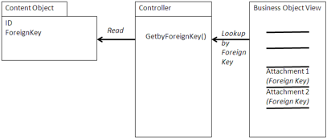

# Attachment

An attachment is a document logically attached to a business object in an application, such as an invoice, a contract, or a quality control report. The attachment is important in the process in which the business object is involved, providing documentation such as transactional information or quality data. The attachment may be added outside the application, such as in Alfresco Share with a Share extension, or it may be added by the application, either by adding the content directly or using a browser to find existing content. The attachment is generally available when users access or browse the business object.

## Using an Attachment

In the design of the attachment, you must first determine how the content will be associated with the business object. If the sole purpose of the document is to act as an attachment to one and only one business object, then it is best to have a foreign key \(http://en.wikipedia.org/wiki/foreign\_key\) as part of an Alfresco type or aspect. If the application is responsible for managing the relationship, such as in SAP, then it is still a good idea to have a foreign key to provide a backward reference for access to the business object. If there is more than one business object associated with a document or the document is used for other purposes, you can either use an aspect with a repeating foreign key or use an association in Alfresco. If you are using CMIS, then you must use a foreign key in a type or association.

The attachment first needs to exist in the Alfresco repository. If the application either creates or captures the document that will become the attachment, then the application stores the document in the repository. Applications generally place the content in well-known locations or create the folders/spaces in which to place the content to simplify a user’s interaction with the application.

If the attachment already exists in Alfresco, you can add it either in Alfresco Share or using a browser in the application. In Share, you can create a special property sheet associated with an application-specific aspect that allows you to choose a foreign key to associate with the document by querying the applications database for a list of foreign keys. If the application adds the attachment, then the application can present a browser to choose the document to attach.

If the application provides an interface to add an attachment, then it must also provide an interface to remove an attachment. When the user navigates to a Business Object in the application, the application provides links to the attachment. Normally this would open the attachment either in situ or in a separate window.

## When to use an Attachment

Many ERP and CRM applications already provide interfaces to attach content from content management systems or archives. Alfresco makes a good alternative to other systems for this purpose.

If an application drives a business process with a requirement to document data \(such as invoices or receipts\) being entered into a business object, the application needs an object, like an attachment.

If there are reference materials that can help explain a set of data or some other context and the users are capable of adding this content, then an attachment is a good mechanism for allowing users to generate and attach this content.

## Example

The SAP ArchiveLink integration created by CTAC, a system integrator in Germany, implements the Content Services Mapping protocol to allow access of SAP systems to external ECM systems.

On top of the ArchiveLink protocol, SAP implements the Archive and Query pattern to store and find content in the underlying ECM system. The Attachment pattern is associated with individual business objects in SAP to access the content. Although the metadata is stored in SAP, a copy is made in Alfresco by the CTAC system. The content is accessed from the attachments through the ArchiveLink protocol.

**Parent topic:**[Content management integration patterns](../concepts/integration-patterns.md)

