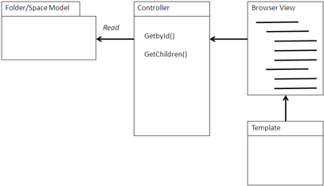

# Browser view

A Browser view generates a file system Explorer–like view on top of the repository.

In a Browser view, the user drills down a hierarchical view of the repository folder structure, and the view then guides the user to the next level of the hierarchy. Normally, this tree structure is exposed in a single view that expands as a tree. However, it may also be presented as a single level at a time with a breadcrumb trail showing a user’s current location. Browsers are useful for general purpose browsing of a repository to allow the user to explore the structure of the repository.

Browsers can also take the form of dialogs similar to Open File dialogs, which you can use to find and select content for articles within the application, or attachments to attach content to business objects in the application.



## Using a Browser view

A Browser view typically begins with a starting folder, which can be the root folder, the user’s home folder, or another folder that has a semantic context, such as a project or team folder. From this starting point, a model is constructed that traverses all the children in that folder using either web scripts or CMIS.

Alternatively, a Browser view can navigate a category structure. Since there is no standardized structure of categories within CMIS, it is best to use web scripts to navigate the hierarchy. A parent-child hierarchy is very similar to a folder-child hierarchy.

Some of the first general-purpose tools built using CMIS were browsers using the Browser view. These browsers were designed to exercise the CMIS interface and provide value-added viewing and exploration on top of these views.

A view constructs a page or page component with the Container object and its immediate children, usually starting with the children that are themselves Containers. Unlike the Query view, which presents a normalized view of the result set, a Browser view usually constructs a Property view that is specific to the type of the child. For instance, folders would be presented as leading to a new level, documents might have document-oriented information and actions, and web pages may have their URLs listed. Normally all the information required is immediately available as part of the child object.

When a child is clicked, the view recurses to the next level, either refreshing the view to the next level or expanding an indented or accordion view of the next level. The navigation tree of Container nodes may display in a separate view. For a simpler view, particularly in more limited portal environments, a flat structure is more often used but should contain a breadcrumb trail above the list of children. This trail prevents the user from getting lost and enables a quick return to previous levels. The easiest way to maintain a consistent breadcrumb that is compatible with the Back button of a browser is to walk the primary ancestor path of a node.

As with the Query view, the Browser view constructs the actions for the user to take as a set of URL links behind the metadata that is presented by the view. This can take the form of accessing the content directly or leading to a specialized property page. Browsers generally replace Share or Explorer, so are less likely to point to those applications for property sheets.

## When to use a Browser view

Browsers are useful for general-purpose content management and document management applications where Alfresco Share and Explorer are not appropriate for portability or platform reasons.

Browsers are particularly useful where folders are a logical organizer of information. They do not replace, but can supplement, Query views. Folder structures often mimic organization, team, project, and record hierarchies, so browsers are useful for navigating these structures. Collaboration sites may organize their content in such structures and provide a Browser view.

Some of the first general-purpose tools built using CMIS were browsers using the Browser view. These browsers were designed to exercise the CMIS interface and provide value-added viewing and exploration on top of these views.

## Example: Drupal Repository Browser

In the following Drupal integration example, the CCK is used, providing the presentation layer functionality. The Browser Controller uses CMIS to get the children of the current node based upon which level you are browsing. In the Drupal example, it starts with the Company Home Page. Following are some of the helper methods for accessing CMIS calls.

```
 /**
 * Implementation of cmisapi_getRepositoryInfo method 
 *
 */
function cmis_alfresco_cmisapi_getRepositoryInfo() {
  static $repository_info;

  if (empty($repository_info)) {
    module_load_include('utils.inc', 'cmis_alfresco');

    $response = cmis_alfresco_invoke_service('/api/repository');
    $xml = cmis_alfresco_utils_get_CMIS_xml($response);

    if ($xml) {
      $cmis = $xml->workspace->children(cmis_alfresco_utils_ns('cmis'));
      $repository_info = $cmis->repositoryInfo;
    } 
  }
return $repository_info;
}

/**
 * Implementation of cmisapi_getChildren method
 * 
 * @param $repositoryId
 * @param $folderId
 */
function cmis_alfresco_cmisapi_getChildren($repositoryId, $folderId) {
  module_load_include('utils.inc', 'cmis_alfresco');

  $folderId = cmis_alfresco_objectId($folderId);
  if ($folderId['noderef_url']) {
    $url = '/api/node/'. $folderId['noderef_url'];
  }
  else {
    $url = $folderId['url'];
  }

  $response = cmis_alfresco_invoke_service($url .'/children');
  if (false != $response) {
    return _cmis_alfresco_getEntries(cmis_alfresco_utils_get_CMIS_xml($response,
        '//D:entry'));
  }

return FALSE;
}

/**
 * Implementation of cmisapi_getObjectParents method
 * 
 * @param $repositoryId
 * @param $folderId
 */
function cmis_alfresco_cmisapi_getObjectParents($repositoryId, $folderId) {
  module_load_include('utils.inc', 'cmis_alfresco');

  $folderId = cmis_alfresco_objectId($folderId);
  if ($folderId['noderef_url']) {
    $url = '/api/node/'. $folderId['noderef_url'];
  }
  else {
    $url = $folderId['url'];
  }

  $response = cmis_alfresco_invoke_service($url .'/parent');
  if (false != $response) {
    return _cmis_alfresco_getEntries(cmis_alfresco_utils_get_CMIS_xml($response,
    '//D:entry'));
  }

return FALSE;
}

/**
 * Implementation of cmisapi_getProperties method
 * 
 * @param $repositoryId
 * @param $objectId
 */
function cmis_alfresco_cmisapi_getProperties($repositoryId, $objectId) {
  module_load_include('utils.inc', 'cmis_alfresco');
  $objectId = cmis_alfresco_objectId($objectId);

  if ($response =cmis_alfresco_invoke_service(
          '/api/node/'.$objectId['noderef_url'])) {
    if ($entries = _cmis_alfresco_getEntries(
            cmis_alfresco_utils_get_CMIS_xml($response, '//D:entry'))) {
      return $entries[0];
    }
  }

  watchdog('cmis_alfresco_cmisapi_getProperties', 'Unknown objectId "@objectId"',
             array('@objectId' => $objectId));
return FALSE;
}

/**
 * Implemetation of cmisapi_getContentStream method
 * 
 * @param $repositoryId
 * @param $objectId
 */
function cmis_alfresco_cmisapi_getContentStream($repositoryId, $objectId) {
module_load_include('utils.inc', 'cmis_alfresco');

  $objectId = cmis_alfresco_objectId($objectId);
return cmis_alfresco_invoke_service('/api/node/content/'. $objectId['noderef_url']);
}
```

The following Drupal module processes the XML entries that return from the CMIS AtomPub call. There is no standard Atom entry processing in Drupal.

```
 /**
 * Process CMIS XML.
 * 
 * @param $xml CMIS response XML. 
 * @param $xpath xpath expression.
 */
function cmis_alfresco_utils_get_CMIS_xml($xml, $xpath = NULL) {
  try {
    $cmis_service = new SimpleXMLElement($xml);
  } 
  catch (Exception $e) {
    cmis_error_handler('cmis_alfresco_utils_get_CMIS_xml', $e);
    throw new CMISException(t('Unable to process xml.'));
  }

  foreach (cmis_alfresco_utils_get_namespaces() as $ns => $namespace) {
    $cmis_service->registerXPathNamespace($ns, $namespace);
  }

  if ($xpath) {
    return $cmis_service->xpath($xpath);
  }

  return $cmis_service;
}

/**
 * Utility function for returning CMIS objects from cmis response
 * (ie. getChildren, query, getDescendants)  
 * 
 * @param $entries
 * @return array
 */
function _cmis_alfresco_getEntries($entries) {
  $result = array();
  foreach ($entries as $entry) {
    $cmis_object = _cmis_alfresco_utils_entry($entry);    
    $cmis_object->properties = array();
    $cmis_element = $entry->children(cmis_alfresco_utils_ns('cmis'));
    foreach (_cmis_alfresco_utils_known_property_types() as $type) {
      $property_tag = 'property'. $type;
      foreach ($cmis_element->object->properties->$property_tag as $property) {
        $attrs = $property->attributes(cmis_alfresco_utils_ns('cmis'));
        $cmis_object->properties[(string) $attrs->name] =
              cmis_alfresco_utils_cast($property->value, $type);
      }
    }

    $cmis_object->type = $cmis_object->properties['BaseType'];

    if ($cmis_object->type == 'document') {
      $cmis_object->size = $cmis_object->properties['ContentStreamLength'];
      $cmis_object->contentMimeType =
          $cmis_object->properties['ContentStreamMimeType'];
      $cmis_object->versionSeriesCheckedOutBy =
           $cmis_object->properties['VersionSeriesCheckedOutBy']; 
    }

    $result[] = $cmis_object;
  }

return $result;
}

/**
 * Utility function for returning a common entry object from a feed entry 
 * 
 * @param $xml_element
 * @return stdClass 
 */
function _cmis_alfresco_utils_entry($xml_element) {
  $entry = new stdClass();

  $tmp_objectId = cmis_alfresco_objectId((string) $xml_element->id);
  $entry->id = $tmp_objectId['noderef'];

  $entry->title = (string) $xml_element->title;
  $entry->summary = (string) $xml_element->summary;
  $entry->updated = date_create($xml_element->updated);
  $entry->author = (string) $xml_element->author->name;

return $entry;
}

/**
 * Utility function form casting cmis properties
 * 
 * @param $value
 * @param $type
 * @return mixed
 */
function _cmis_alfresco_utils_cast($value, $type) {
  $return = NULL;
  switch ($type) {
  case 'Integer':
    $return = (int) $value;
    break;
  case 'Boolean':
    $return = (bool) $value;
    break;
  case 'String':
  case 'Id':
    $return = (string) $value;
    break;
  case 'DateTime':
    $return = date_create((string) $value);
    break;
  default:
    $return = $value;
  }

return $return;
}

/**
 * Utility function for encoding cmis properties
 * 
 * @param $propertyCollection
 * @return string
 */
function _cmis_alfresco_utils_properties_to_xml($propertyCollection = array()) {
  $properties_xml = '';

  foreach ($propertyCollection as $key => $value) {
    $property_type = gettype($value);

    switch ($property_type) {
    case 'integer':
    case 'boolean':
    case 'string':
      $properties_xml .= '<cmis:property'. ucfirst($property_type)
         .'cmis:name="'. $key .'">';
      $properties_xml .= '<cmis:value>'. $value .'</cmis:value>';
      $properties_xml .= '</cmis:property'. ucfirst($property_type) .'>';
      break;
    default:
      watchdog('_cmis_alfresco_utils_properties_to_xml',
          'Unable to map property "@property" of type "@property_type" '.
          'for destination object "@objectId"',
          array('@property' => $key, '@property_type' => $property_type,
              '@objectId' => $objectId), WATCHDOG_ERROR);

      drupal_set_message(t(
          'Unable to map property "@property" of type "@property_type" for ' .
          'destination object "@objectId"',
          array('@property' => $key, '@property_type' => $property_type,
             '@objectId' => $objectId)), 'error');
    }
  }

return $properties_xml;
}
```

These calls, in turn, are used to hook into the CCK, which has predefined templates for presenting forms and tabular information of similar types. Reusing work to integrate other hierarchical browsers, tabular results, and metadata forms, this Drupal integration provides the following hook points.

```
<?php
// $Id: cmis_alfresco_field.module,v 1.2 2009/09/09 16:51:41 cbalan Exp $

/**
 * Implementation of hook_field_settings
 * 
 * @param $op - operation
 * @param $field - field begin operated on
 * @return - form or settings array dependent on operation
 */
function cmis_alfresco_field_field_settings($op, $field) {
  switch ($op) {
  case 'form':
    $form['root_directory'] = array(
        '#title' => t('Root Directory'),
        '#description' => t('Root Directory for Alfresco nodes'),
        '#type' => 'textfield',
        '#autocomplete_path' => 'cmis/autocomplete',
        '#default_value' => '/Company Home',
      );
    return $form;

  case 'save':
    $settings = array('root_directory');
    return $settings;

  case 'database columns':
    $columns = array(
      'path' => array('type' => 'varchar', 'length' => 255, 'not null' => FALSE),
    );
    return $columns;
  }
}

/**
 * 
 * @param $op - operation
 * @param $node - node
 * @param $field - field settings
 * @param $items - field value(s)
 * @param $teaser - boolean for whether or not we're displaying a teaser
 * @param $page - boolean for whether or not we're displaying a page
 * @return unknown_type
 */
function cmis_alfresco_field_field($op, &$node, $field, &$items, $teaser, $page) {
  switch ($op) {
  case 'validate':
    foreach ($items as $i) {
      if (empty($i)) {
        form_set_error('', 'The field cannot be empty');
      }
    }
  return $items;
  break;
  }
}

/**
 * Implementation of hook_widget_info
 * 
 * @return array defining the widget
 */
function cmis_alfresco_field_widget_info() {
  return array(
    'cmis_alfresco_field_widget' => array(
       'label' => t('Alfresco browser'),
       'field types' => array('cmis_alfresco_field'),
       'multiple values' => CONTENT_HANDLE_CORE,
       'callbacks' => array('default value' => CONTENT_CALLBACK_CUSTOM),
       'description' => t('Click to browse the Alfresco repository and ' .
            'select an Alfresco node to associate with this Drupal node.' )
    )
  );
}

/**
 * Implementation of hook_elements()
 * 
 * @return array elements to be processed by FAPI
 */
function cmis_alfresco_field_elements() {
  return array(
    'cmis_alfresco_field_widget' => array(
      '#input' => TRUE,
      '#process' => array('cmis_alfresco_field_widget_process')  
  )
  );
}

/**
 * Implementation of hook_process()
 * 
 * @param $element - the form element array
 * @param $edit - 
 * @param $form_state - form state array
 * @param $form - form array
 * @return array - form element
 */
function cmis_alfresco_field_widget_process($element, $edit, $form_state, $form) {
  $defaults = $element['#value'];
  if (!is_array($defaults)) {
    $defaults = unserialize($defaults);
  }

  $element['path'] = array(
    '#type' => 'textfield',
    '#default_value' => $defaults['path'],
    '#autocomplete_path' => 'cmis/autocomplete',
  );

return $element;
}

/**
 * Implementation of hook_widget()
 * 
 * @param $form - form array
 * @param $form_state - form state array
 * @param $field - field array
 * @param $items - field values
 * @param $delta - id of the field (if there is more than one in the form)
 * @return form element array
 */
function cmis_alfresco_field_widget(& $form, & $form_state, $field, $items,
                $delta = 0) {
  $element = array(
    '#type' => $field['widget']['type'],
    '#default_value' => isset($items[$delta]) ? $items[$delta] : ''
  );

return $element;
}

/**
 * Implementation of hook_field_formatter_info
 * 
 * @return array
 */
function cmis_alfresco_field_field_formatter_info() {
  return array( 
    'default' => array( 
       'label' => t('Alfresco browser'),
       'field types' => array('alfresco_cmis_field')
    )
  );
}

/**
 * Implementation of hook_theme()
 * 
 * @return array of theme functions
 */
function cmis_alfresco_field_theme() {
  return array(
    'cmis_alfresco_field_widget' => array('arguments' => array('element')),
    'cmis_alfresco_field_formatter_default' =>
         array('arguments' => array('element' => NULL))
  );
}

/**
 * Function to theme the widget form
 * @param $element
 * @return string - themed output of the widget
 */
function theme_cmis_alfresco_field_widget(&$element) {
return theme('form_element', $element, $element['#children']);
}

function theme_cmis_alfresco_field_formatter_default($element = NULL) {
if (empty( $element['#item'])) {
return '';
  }

return print_r($element, TRUE);
}
```

The most important part of the previous example is the first section, which gets the repository information, enumerates through children in a folder, and gets the properties of an entry. The sections that follow are common for browser-style interfaces that present a user interface. The second section handles the mechanics of manipulating the Atom feed generated by CMIS, as well as the feed to CMIS. In this case, neither Drupal nor PHP has a native library for handling Atom and its data types, but the functions presented can be reused for these purposes and are not specific to Alfresco. Finally, the hook functions in the last section are needed to integrate the browser with the CCK, but are similar to other Drupal theme extensions using CCK.

**Parent topic:**[Content management integration patterns](../concepts/integration-patterns.md)

