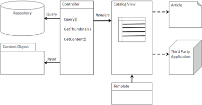

# Catalog view

A Catalog view is either a Query view or a specialized Browser view to present a list of items to act upon, such as purchasing the item being presented.

A Catalog view may make extensive use of images. The number of items may determine whether to use a Query view, a Browser view, or both. The List view of the catalog will present information specific to what the content is describing rather than the content object itself. Likewise, a detail or Property Sheet view will present metadata and actions relevant to the subject of the content rather than the content. For instance, a catalog of products may have a set of images, but present information and metadata about the product rather than the actual photo. However, a catalog can still present photos and articles and be content-specific since that may be the subject matter of the catalog.



## Using a Catalog view

A Catalog view uses a Query view either when there are relatively few items or when a categorization is not appropriate, often because there are too many categories. A catalog of articles is a relatively simple example of a catalog and does not really require much structure if there are a dozen or so articles. If there are tens of thousands of items that are not easily accessible through a category structure, then queries may be the easier way to access the catalog item. Here you might use additional Query views to show recently added items.

A Catalog view uses a Browser view when there is a moderate number of items and is easily browsed and accessed through a folder or category hierarchy. Using the native folder system in a subset of folders is usually the best way to manage the catalog for presenting catalog items through a Browser view. Even in this case, it is usually best to provide a Query view to find the catalog items.

The view generated for either the Query view or the Browser view may be presented differently than in the normal views. If the catalog is more visual because the content is an image or a thumbnail is more important than the metadata, then the view may generate more of a ‘‘Light Box’’ view that adds as many images as possible on a page or page component. Otherwise, a standard Browser view list would be more appropriate.

The property sheet should present the actions that are appropriate for the purpose of the catalog, such as download or purchase. Metadata should be kept to a minimum, such as name, description, and date added or available.

## When to use a Catalog view

Catalogs are useful for presenting lists of articles or images that can be used for business purposes. Catalogs can enhance applications by presenting lists of content that might be helpful in using the application.

## Example: Image Gallery in Alfresco Share

An image gallery, in this case of photos or graphics, is a good example of a catalog. The image gallery available with Alfresco Share is an example of how you can build a similar catalog-type interface using FreeMarker with the Alfresco API. Since FreeMarker is a web templating engine, this example shows the type of data, images, and presentation that are required.

```
<#macro detailsUrl image label>
  <a href="${url.context}/page/site/${page.url.templateArgs.site}\
/document-details?nodeRef=${image.nodeRef}" class="theme-color1">${label}
  </a>
</#macro>
<script type="text/javascript">//<![CDATA[
  new Alfresco.ImageSummary("${args.htmlid}");
  new Alfresco.widget.DashletResizer("${args.htmlid}", "${instance.object.id}");
//]]></script>
<div class="dashlet">
  <div class="title">${msg("header.title")}</div>
  <div id="${args.htmlid}-list" class="body scrollableList"
        <#if args.height??>style="height: ${args.height}px;"</#if>>
    <#if images.message?exists>
      <div class="detail-list-item first-item last-item">
        <div class="error">${images.message}</div>
      </div>
    <#elseif images.items?size == 0>
      <div class="detail-list-item first-item last-item">
        <span>${msg("label.noitems")}</span>
      </div>
    <#else>
      <#assign detailsmsg = msg("label.viewdetails")>
      <#list images.items as image>
        <#assign nodeRefUrl=image.nodeRef?replace('://','/')>
        <div class="images">
          <div class="item">
            <div class="thumbnail">
              <a href="${url.context}/proxy/alfresco/api/node/content/\
${nodeRefUrl}/${image.name?url}"
                   rel="lightbox"
                   title="${image.title?html} –
                   ${msg("text.modified-by", image.modifier)}
                   ${image.modifiedOn?datetime(
                     "dd MMM yyyy HH:mm:ss 'GMT'Z '('zzz')'")
                   ?string("dd MMM, yyyy HH:mm:ss")}">
                
              </a>
            </div>
            <div class="details">
              <@detailsUrl image detailsmsg />
            </div>
          </div>
          </div>
        </#list>
      </#if>
    </div>
</div>
```

In this example, the `#list` directive of FreeMarker iterates through the items in a space dedicated to images. A thumbnail generated by the Thumbnail service is accessed from the repository and placed next to the metadata. Within a catalog, thumbnails are a good way to present images, products, or media for detailed access and actions, such as download or purchase.

**Parent topic:**[Content management integration patterns](../concepts/integration-patterns.md)

