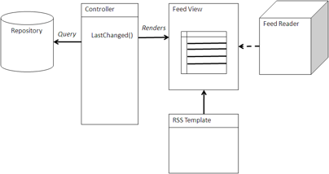

# Feed

Some applications can access or track content using RSS feeds. Some examples are mail clients, feed readers, or portals that have feed readers built in.

With these feed readers, the application can track changes or actions that a user needs to take in a workflow. Feeds are a good way to track the changes in a repository that, in turn, can be a good way to track what is happening in the business if you are tracking business critical documents or web pages.



## Using a Feed

You can implement a as a simple Query view implemented as a web script that is rendered as an RSS feed using an RSS template. There are default feeds defined in Alfresco Share and Explorer, so these do not need to be coded if the default feeds suit your purpose. The links from the feed can either be directed to the content directly or the Properties page in Alfresco Share. The web script can also render the Activities feed to track changes across multiple sites.

## When to use a Feed

Use a feed to track process changes or changes in business critical information in a repository. Workflow changes are tracked well if they are delivered to a favorite feed reader. Also, feeds can be an easy way to integrate into a portal.

## Example: Activities Atom Feed

The following is an example of an Atom subscription feed implemented using the FreeMarker API. Specifically, this is getting the activities associated with a site and returning the latest updates as an Atom feed.

```
<#assign mode = args.mode!"">
<#if mode = "user">
  <#assign title=msg("atom.title.user", user.fullName?xml)>
<#else>
  <#assign title=msg("atom.title.site", args["site"]?xml)>
</#if>
<#assign genericTitle=msg("title.generic")>
<?xml version="1.0" encoding="UTF-8"?>
  <feed xmlns="http://www.w3.org/2005/Atom">
    <generator version="1.0">Alfresco (1.0)</generator>
    <link rel="self" href="${absurl(url.full)?xml}" />
    <id>${absurl(url.full)?xml}</id>
    <title>${title?xml}</title>
    <#if activities?exists && activities?size &gt; 0>
      <updated>${activities[0].date.isoDate}</updated>
      <#list activities as activity>
        <#assign userLink="
          <a href=\"${absurl(activity.userProfile)}\">
                ${activity.fullName?html}</a>">
        <#assign itemLink="
          <a href=\"${absurl(activity.itemPage)}\">
                ${activity.title?html}</a>">
        <#assign siteLink="
          <a href=\"${absurl(activity.sitePage)}\">
                ${activity.siteId?html}</a>">
        <entry xmlns='http://www.w3.org/2005/Atom'>
          <#assign detail = msg(activity.type, activity.title?xml,
                activity.fullName?xml,activity.custom0, activity.custom1)>
          <#if mode="user" && !activity.suppressSite>
            <#assign detail=msg("in.site", detail, activity.siteId?xml)></#if>
          <title><![CDATA[${detail?xml}]]></title>
          <link rel="alternate" type="text/html"
                      href="${absurl(activity.itemPage)}" />
          <id>${activity.id}</id>
          <updated>${activity.date.isoDate}</updated>
          <#assign detailHTML = msg(activity.type, itemLink, userLink,
                      activity.custom0, activity.custom1)>
          <#if mode = "user" && !activity.suppressSite>
            <#assign detailHTML = msg("in.site", detailHTML, siteLink)></#if>
          <summary type="html">
            <![CDATA[${msg(detailHTML)}]]>
          </summary>
          <author>
            <name>${activity.fullName?xml}</name>
            <uri>${absurl(activity.userProfile)?xml}</uri>
          </author>
        </entry>
      </#list>
    </#if>
  </feed>
</xml>
```

The `#list`directive in FreeMarker is used to iterate through the Activities of the site. FreeMarker has access to the activities as a collection and this script accesses each activity and formats the information specified by the Atom Subscription specification, including name, author, and date.

**Parent topic:**[Content management integration patterns](../concepts/integration-patterns.md)

