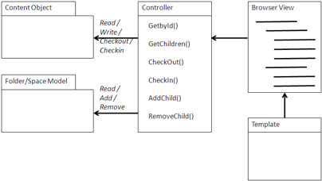
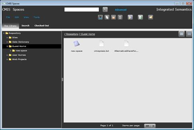

# Librarian

A Librarian is a specialized browser that controls the content in a hierarchical view. Because the primary context in which content normally lives within an Alfresco repository is the folder/space hierarchy, the Browser view is the natural place to put library type controls.

Library services describe the Check Out and Check In services originally designed for engineering document control, but has been extended to document management and web content management. It provides the tools to edit the content with integration to the appropriate authoring application, which may or may not be available within the browser, depending upon the MIME type of the content. It also provides a view to explore the version history of a content object.

## Using a Librarian

A Librarian provides the hierarchical browsing experience of a browser, while adding the ability to check out a content object for revision. It also provides a property sheet for metadata entry and update, an interface to add or replace the content file, and a form to check in the content object. In addition, there is a Query view for exploring and accessing the version history of a content object.

The Librarian view presents specific actions for the content Check Out and Check In. It must also present a property sheet to edit the content object properties with whichever properties should be editable, as well as those properties that are mandatory. This information is available from the Data Dictionary, which is accessible through web scripts and CMIS if the Librarian dynamically generates the forms for different types.

The Librarian view provides the interfaces for adding or replacing content. If the MIME type of the content is text, HTML, or even some types of XML, it may be possible to provide an editing tool within the browser application. More complex AJAX applications can be used to manipulate even more complex document types, such as graphical drawings and Office documents. In most cases beyond basic text and HTML, the Librarian will be responsible for launching the correct application or will use the MIME type for the browser to launch the correct application. Using WebDAV to edit the document makes it possible for the application to replace the content in the repository; the repository then controls versioning and user permissions.

## When to use a Librarian

A Librarian is useful for applications that provide general or special purpose controls of large amounts of content. A general purpose document management tool that is independent of an underlying repository usually implements a Librarian. Image-scanning and management tools are also Librarians. Applications that manage special purpose libraries, such as research libraries, reference materials, or policy libraries, are vertical examples of libraries. However, these are often best handled with something like the Alfresco Share application or a general-purpose CMIS library tool extended with domain specific pages or forms.

## Example

CMIS Spaces, from Integrated Semantics, is a CMIS-based Librarian that uses Adobe Flex for the user interface. Flex provides a very rich browser experience with all the functionality of a thick client. CMIS Spaces can be distinguished from a browser in that it provides library services for uploading and updating content as well as manipulating metadata.

CMIS Spaces provides Rich Internet Application \(RIA\) clients for Flex and AIR \(the Adobe client-based runtime\) Flex and Internet browser \(such as Microsoft IE or Mozilla Firefox\). CMIS Spaces uses the UI-independent ActionScript \(Adobe’s JavaScript-like script-based process language\) and APIs for both CMIS AtomPub REST and CMIS web services \(SOAP\). It uses a number of other open source projects, such as Cairngorm, Presentation Model pattern, and Spring ActionScript.

CMIS Spaces’ Flex+AIR configuration also can handle the headers and delete/put HTTP verbs for AtomPub updating. For Flex+Browser AtomPub updating, CMIS Spaces can be configured to use sockets \(as 3httpclientlib\).

**Parent topic:**[Content management integration patterns](../concepts/integration-patterns.md)

