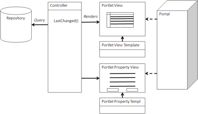

# Portlet view

Many Alfresco installations use Alfresco in conjunction with portals, such as Liferay. Portals provide a page view composed of individual windows called portlets, which aggregate and assemble information according to a user’s preference. Content from content management systems is often some of the most important information that comes through a portal in the form of corporate news, key business decisions, changes in plans or products, or policies and procedures.

A portlet consists of specialized Query views or Browser views. The portlets are designed to work with JSR-168 or JSR-286–compatible portals. The presentation technology is either web scripts or Surf. Depending on how they are rendered, they can also be used as Google Gadgets, which is a similar technology. The Portlet views can be used for tracking workflow tasks, currently checked-out documents, activities from Share sites, or documents of interest to the user based upon topic or keyword. A Portlet view can also present a Browser view for navigating a repository from the portal.



## Using a Portlet view

A portlet view wraps a Query view or a Browser view within a JSR-168 container. This container persists preferences and can provide configuration information for the portlet, as well as authentication and personalization.

The portlet redirects a request to a web script, which in turn renders a Query view as a JSR-168 portlet. The actions rendered by the Query view should be consistent with a portlet. For example, when a view accesses a content and details page, this should be handled in a portal-friendly way.

A Property view in a portal should be its own portlet, allowing the user to navigate correctly through the portal. In this case, the Property view should appear as a portlet, providing details of an object that would have been clicked through from a Query view or Browser view.

## When to use a Portlet view

Portals are useful when integrating information from many sources, particularly across the enterprise. When you wish to present more than just content from Alfresco, such as news feeds, general information \(for example, weather\), information from other enterprise applications, or analytical dashboards, a portal can be a good choice for accessing Alfresco as well. Liferay is the most common open source portal used with Alfresco. However, other portals have also been used, such as IBM WebSphere, Oracle/BEA WebLogic, and Microsoft SharePoint.

## Example: Liferay and CMIS

The following is an example of a portlet designed to work in the Liferay portal using CMIS to access the repository. It uses a basic XML parser to handle the AtomPub protocol for accessing CMIS.

```
package training;

import java.io.IOException;
import java.io.PrintWriter;
import java.io.Writer;

import javax.portlet.ActionRequest;
import javax.portlet.ActionResponse;
import javax.portlet.GenericPortlet;
import javax.portlet.PortletException;
import javax.portlet.PortletSecurityException;
import javax.portlet.PortletSession;
import javax.portlet.PortletURL;
import javax.portlet.RenderRequest;
import javax.portlet.RenderResponse;
import javax.xml.parsers.DocumentBuilderFactory;

import org.apache.commons.httpclient.Credentials;
import org.apache.commons.httpclient.HttpClient;
import org.apache.commons.httpclient.UsernamePasswordCredentials;
import org.apache.commons.httpclient.auth.AuthScope;
import org.apache.commons.httpclient.methods.GetMethod;
import org.w3c.dom.Document;
import org.w3c.dom.Element;
import org.w3c.dom.NodeList;

public class AlfrescoTrainingPortlet extends GenericPortlet {

  @Override
  protected void doView(RenderRequest request, RenderResponse response)
     throws PortletException, IOException
  {

    response.setContentType("text/html");

    HttpClient client = new HttpClient();
    client.getParams().setAuthenticationPreemptive(true);
    Credentials defaultcreds = new UsernamePasswordCredentials("admin", "admin");
    client.getState().setCredentials(AuthScope.ANY, defaultcreds);
    String url;

    String objectIdParam = (String)    request.getPortletSession()
            .getAttribute("objectId", PortletSession.PORTLET_SCOPE);
    if (objectIdParam == null) {
      url = http://localhost:8080/alfresco/s/api/path/workspace/SpacesStore/"+
              "Company%20Home/children";
    } else {
      url = "http://localhost:8080/alfresco/s/api/node/workspace/SpacesStore/" + 
            objectIdParam + "/children";
    }

    GetMethod method = new GetMethod(url);
    client.executeMethod(method);
    PortletURL actionURL = response.createActionURL();

    PrintWriter writer = response.getWriter();
    try {
      Document dom = DocumentBuilderFactory.newInstance().newDocumentBuilder()
            .parse(method.getResponseBodyAsStream());
      NodeList list = dom.getElementsByTagName("cmis:propertyId");
      int len = list.getLength();
      for (int i = 0; i < len; i++) {
        Element element = (Element) list.item(i);
        String propertyName = element.getAttribute("cmis:name");
        String objectId = null;
        if (propertyName.equals("ObjectId")) {
          objectId = element.getElementsByTagName("cmis:value")
                .item(0).getTextContent();
          objectId = objectId.replaceAll("workspace://SpacesStore/", "");
          writer.println("<p>" + objectId);
        }
        if (objectId == null) {
          continue;
        }
        NodeList stringList = ((Element) element.getParentNode())
              .getElementsByTagName("cmis:propertyString");
        int stringSize = stringList.getLength();
        for (int j = 0; j < stringSize; j++) {
          Element strElem = ((Element) stringList.item(j));
          String strName = strElem.getAttribute("cmis:name");
          if (strName.equals("Name")) {
            actionURL.setParameter("objectId", objectId);
            writer.println("<a href='" + actionURL.toString() + "'>"
                  + strElem.getTextContent() + "</a>");
            break;
          }
        }
      }
    } catch (Exception exc) {
     exc.printStackTrace();
    }
  }

  @Override
  public void processAction(ActionRequest request, ActionResponse response)
      throws PortletException, PortletSecurityException, IOException
  {
    String objectId = request.getParameter("objectId");
    if (objectId != null) {
      request.getPortletSession().setAttribute("objectId", objectId,
              PortletSession.PORTLET_SCOPE);
    }
  }
}
```

This class, specialized from GenericPortlet, uses the method `doView()` to actually create the Portlet view. It is using CMIS `getChildren()` to get the children of the folder browsed, initially the Company Home at the top of the repository. It constructs a Browser view specialized for a portlet and creates links for the next level of browsing. It also iterates through all the properties to display their values in the portlet.

**Parent topic:**[Content management integration patterns](../concepts/integration-patterns.md)

