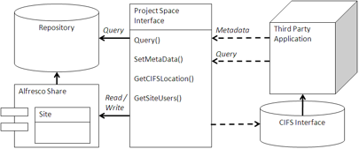

# Project Space

A Project Space is a place for users of an application to share ideas, comments, documents, emails, and other information.

If a business application is very data-centric, then it will generally not have a good place to store unstructured information as the users of the application develop changes to configuration or structured information that may go into the application. Given a certain context and structure, a Project Space can enhance a data-centric business application to take advantage of collaboration between users of the application. Share, in turn, can access information through a view presented by the business application.

## Using a Project Space

A Project Space is really a cooperation of two applications: the business application and Alfresco Share. The business application interacts with Share through an interface similar to an archive to store and retrieve information. This can either be through a file emulation interface, such as CIFS, NFS, or FTP, or through an API. This is where the business application deposits information that might be useful for the collaboration, such as reports or analysis.

To capture the results of the project, it is best to provide a view on the business application to the users of the Project Space with a Page Component for Alfresco Share that may simply expose an iFrame or through a Share dashlet, which again can be an iFrame. A button or interface on or near this view can capture the action taken in the business system to record the results.

## When to use a Project Space

In Customer Relationship Management or Bid Management systems, large teams may collaborate in the creation of offerings and terms for customers. A Project Space provides a space for them to discuss and decide on approaches and iterate on the offerings or contracts.

The document management system provides the tools for creation, management, reuse, and delivery of the output, while the CRM system takes the result as an attachment, thus enhancing the sales process.

Configuration of complex data or structures in a business application, such as an ERP or CRM system, can be difficult to track. By turning the process into a recipe upon which other people collaborate, it is possible to walk through the scenarios of what changes in the configuration would mean and then take action. If the change in configuration is not complete, then the team can collaborate on new configurations. Alfresco Share would allow them to document changes, discuss the possible outcomes, and act. The view from the business application would allow the configuration to take place.

**Parent topic:**[Content management integration patterns](../concepts/integration-patterns.md)

