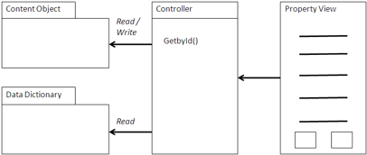

# Property View

A Property view is a building block of any Alfresco or any other content management application. A Property view presents information about a content object based on the content object’s ID.

Usually there will be additional actions that can be performed on the object, such as Download, Check Out/In, Edit using WebDAV, Invoke Workflow, and others. The actions are determined based on the context of the content object in the application and whether the Property view is read-only or editable. An integrated viewer using a Flash viewer or an in-line editor can make for a more streamlined experience for the user.

## Using a Property view

The Property view uses a web script controller to fetch the content object using either CMIS or web scripts.

The Property view accesses the properties needed for the view. If the view is dynamic, then it may use the Data Dictionary or introspection to find out what properties are appropriate for the object fetched. A Property view can be read-only or bi-modal, allowing for editing of properties if appropriate for the application.

The view then constructs an HTML page with the properties and any actions that are appropriate for the object. If the view is read-only, then the Property view is generally very simple, adding only basic controls to download content. However, you can add other controls that are relevant to the application, such as e-commerce or process-related actions. On an OK or Cancel action, control is returned to the Browser or Query view that invoked the Property view and returned to the original context.



It is possible to add a Flash-based viewer, such as the one found in Alfresco Share.

If the view is editable, then a more sophisticated controller must be built, such as the one used in Alfresco Share. It may be best under those circumstances to direct control to the Property view in Share. If it is important for the Edit view, then you can create a special purpose fixed form, use the Data Dictionary to construct a dynamic form, or use the Forms Service from Alfresco Share.

## When to use a Property view

A Property view is generally used with either a Browser view or a Query view and invoked by an action on the line item of either.

You can use the Property view to view basic properties on content or specialize for different types and aspects. Property views can also be specialized based on the nature of the content. For example, if a content object is used to present a product for sale, such as in a catalog, then the Property view can be used to display the content, such as a photo, and provide actions for purchasing the item.

You can also use a Property view for very specialized content types, such as high resolution photos, providing different thumbnail views and exposure information for digital assets in a Digital Asset Management catalog.

## Example: Confluence

Confluence is an enterprise wiki from Atlassian used in many development shops. An integration of Confluence with Alfresco was created using CMIS by Alfresco and SourceSense. See http://code.google.com/p/confluence-alfresco.

The following are some examples of a Property view created to work with the wiki built by Sourcesense. In this case, the view is constructed in Java using the wiki syntax for the wiki to render. It uses the Apache Abdera AtomPub toolkit and the Abdera extensions for CMIS to access the CMIS AtomPub protocol.

```
    private String renderEntry(Entry entry) {
  StringBuilder out = new StringBuilder();
  out.append("||Property||Value||\n");
  ExtensibleElement cmisObject = entry.getExtension(CMISConstants.OBJECT);
  if (cmisObject != null) {
    ExtensibleElement cmisProperties =
      cmisObject.getExtension(CMISConstants.PROPERTIES);
    if (cmisProperties != null) {
      List<Element> cmisProps = cmisProperties.getElements();
      for (Element prop : cmisProps) {

        System.err.println(prop.getQName());

        if (!CMISConstants.CMIS_NS_URI.equals(prop.getQName().getNamespaceURI())){
          continue;
        }
        String name = prop.getAttributeValue(CMISConstants.NAME);
        if (name == null) {
          continue;
        }
        Element cmisValue =
          ((ExtensibleElement)prop).getExtension(CMISConstants.VALUE);
        if (cmisValue != null) {
          String value = cmisValue.getText();
          if (CMISConstants.PROPERTY_BOOLEAN.equals(prop.getQName()))
            value = "true".equalsIgnoreCase(value) ? "(/)" : "(x)";
          else if (CMISConstants.PROPERTY_URI.equals(prop.getQName()))
            value = "[LINK|" + value + "]";
          out.append("|");
          out.append(name);
          out.append("|");
          out.append(value);
          out.append("|\n");
        }
      }
    }
  }
  return out.toString();
}
```

This code snippet is part of a macro extension added into the Confluence wiki engine to iterate to present the properties of a document. In this case, it uses CMIS to fetch the object. The string `out` is used to construct a wiki fragment using wiki syntax. The list of elements `cmisProps` is used to iterate through the properties and present them as a set of attribute value pairs in a wiki-formatted table. The vertical bar is used to separate columns in the table with the property name as one column and the property value as another. The string that is composed is then sent to the wiki formatting engine for presentation when the macro is called.

**Parent topic:**[Content management integration patterns](../concepts/integration-patterns.md)

