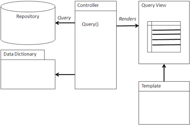

# Query view

A Query view is a general-purpose pattern that generates very application-specific views for accessing sets of content and presenting a consistent set of metadata about that set.

Like most ECM systems, Alfresco provides query facilities that are based on SQL. Alfresco follows the CMIS-query language specification that is based on SQL 92 with extensions to support querying within folders and adding full-text expressions for searching within the text of the content. The view is constructed from the query model and presented to the user for further action, either within the application or by handing control to one of the Alfresco applications, such as Share.



## Using a Query view

You can use a Query view to provide a flat set of content filtered on a specific folder, metadata \(such as a project name or author\), the text within the content \(such as all documents containing the word ‘‘Aspirin’’\), or any combination preceding.

The qualification can be as expressive as SQL. The target list can contain any property that is common to the object types or aspects listed in the FROM clause. The qualification can be either hard-coded in the application or captured from a form in the application. For instance, a form can capture a project to be searched. The query in the Query view can be constructed using the CMIS query specification and sent through either CMIS or web scripts. The query is executed in the repository, which then formats the query results as a flat tuple set with the properties requested by the query. Normally, the content ID is returned so that the content can be retrieved or some other action can be taken on the content. Alfresco can also provide specialized properties specifically for applications and user interfaces, such as icon types. CMIS allows rendition types to be added to queries to present thumbnails with the results. This enables the application to provide visual indicators as well as data indicators of what content information is being returned.

The view in the Query view then constructs a web page with the information retrieved and constructs a set of links for further action. The view is normally built using a templating language geared toward constructing web pages or web page fragments, such as FreeMarker, PHP, or JSP. The view may be part of a wider web framework, such as a portal, Share, or a Surf application. The view will normally present the results in a tabular view with standard metadata, such as name, title, author, and creation date. If a thumbnail rendition is selected, then the thumbnail will normally be of a size that fits neatly into a row associated with a content object. If there are a lot of nodes, it is the responsibility of the view to handle pagination of results sets.

The links constructed by the view are normally URLs linking to the content itself; another page of the application that provides more context or information; the property sheet of the content object in Share where the content preview, metadata, and actions can be found; or another part of the application that may show a more application-specific view of the content properties and actions. If a link to the content needs to be fast, then this may be a direct, read-only link to the content from the content store. If the content needs to be editable, then it is best to use a WebDAV link using the WebDAV protocol. CMIS will construct a direct, read-only link and is portable. An application can construct a link to the Share application by pointing to the right site path and appending the path to the content in the document library. Specialized content views can be constructed for simpler viewing, annotating for linking to other application objects.

## When to use a Query view

A Query view is used when a logical set of content is needed for an application and the content is very commonly used. Use a Query view to assemble content related to a particular topic or subject by using keyword-based properties, tags, or categories provided by Alfresco.

Also use this view to assemble process or project information. In this case, status information captured by Alfresco or the application can be used to filter the appropriate information. Workflow status can also be useful in the query. Content that might be of interest to the end user can be assembled by querying for content that has the user as an author or is waiting on that user for action in a workflow.

A Query view allows the content view to be very specific to the application by filtering out irrelevant content across the repository. Unlike a browser or folder view, only relevant information is displayed, making for a much easier user experience.

## Example: Drupal and OpenSearch

In this example, Drupal already uses OpenSearch as a mechanism to search other content sources, and integrating Alfresco OpenSearch is an easier route to integrating search. This Drupal module successfully mixes CMIS AtomPub for deeper object inspection and creation of content, but is able to simply add Alfresco as another search source. To download the source code and view additional information, visit http://drupal.org/project/cmis\_alfresco.

The following is an implementation in the Drupal Content Construction Kit \(CCK\): http://drupal .org/node/101723.

```
  /**
 * Keyword based search
 * 
 * @param $keyword
 * @param $p
 */
function cmis_alfresco_opensearch_view($keyword = NULL, $p = 1) {
  module_load_include('utils.inc', 'cmis_alfresco');

  // Add opensearch form
  $contents = drupal_get_form('cmis_alfresco_opensearch_form', NULL);

  if ($keyword) {
    $result = cmis_alfresco_invoke_service('/api/search/keyword.atom?q='.
         urlencode($keyword) .'&p='. $p);
  if (false != $result) {

    // Process the returned XML
    $xml = cmis_alfresco_utils_get_CMIS_xml($result);

    // Set up results list
    $contents .= theme('cmis_alfresco_opensearch_results',
         $xml->xpath('//D:entry'));

    // Set up pager
    $opensearch = $xml->children(cmis_alfresco_utils_ns('opensearch'));
    $total_items = (int) $opensearch->totalResults;
    $items_per_page = (int) $opensearch->itemsPerPage;

    if (fmod($total_items, $items_per_page) == 0) {
      $last_page_number = floor($total_items / $items_per_page);
    } 
    else {
      $last_page_number = floor($total_items / $items_per_page) + 1;
    }

    // Add pagination bar
    $contents .= theme('cmis_alfresco_pager', 'cmis/opensearch/'. $keyword .'/',
          $last_page_number);
    } 
    else {
      $contents .= 'Error';
    }
  }

  return $contents;
}
```

The actual Query view is implemented through the Drupal CCK, which ties the OpenSearch query view to a theme.

```
 /**
 * Implementation of hook_theme()
 * 
 */
function cmis_alfresco_theme() {
  return array(
    'cmis_alfresco_opensearch_results' => array('arguments' => array('entries')),
    'cmis_alfresco_pager' => array('arguments' => array('base_search_url',
    'last_page_number'))
  );
}

function theme_cmis_alfresco_opensearch_results($entries) {
  if (empty($entries)) {
    return '<div class="empty-search">There are no results for your search.</div>';
  }

  module_load_include('utils.inc', 'cmis_alfresco');

  foreach ($entries as $entry) {
    $summary = $entry->summary;
    $score = $entry->children(cmis_alfresco_utils_ns('relevance'))->score;
    $updated = date_create($entry->updated);
    $updatedStr = date_format($updated, 'n/j/Y g:i A');
    $alfIcon = $entry->icon;
    $documentLink = l($entry->title, 'cmis/get',
           array('query' => array('id' => $entry->id)));

    $rows[] = array(''. $documentLink,
           $entry->author->name, $updatedStr, $score);
  }

  $contents .= theme('table', $header, $rows);

  return $contents;
}

function theme_cmis_alfresco_pager($base_search_url, $last_page_number) {
  $contents .= '<div class="pagination">';
  $contents .= l('first', $base_search_url .'1');

  for ($counter = 1; $counter <= $last_page_number; $counter++) {
    if ($p!= $counter) {
        $contents .= ' '. l($counter, $base_search_url . $counter);
    }
    else {
      $contents .= ' '. $counter;
    }
  }

  $contents .=  ' '. l('last', $base_search_url . $last_page_number);
  $contents .= '</div>';

  return $contents;
}
```

Where needed, Drupal can also use the CMIS query interface.

```
 /**
 * Implementation of cmisapi_query method
 *   
 * @param $repositoryId
 * @param $statement
 * @param $searchAllVersions
 * @param $includeAllAllowableActions
 * @param $includeRelationships
 * @param $maxItems
 * @param $skipCount
 * @return array
 */
function cmis_alfresco_cmisapi_query($repositoryId, $statement,
              $searchAllVersions = FALSE, $includeAllAllowableActions = FALSE,
              $includeRelationships = NULL, $maxItems = 0, $skipCount = 0)
{
  module_load_include('utils.inc', 'cmis_alfresco');

  $postvars = '<?xml version="1.0" encoding="UTF-8" standalone="yes" ?>'.
      '<query xmlns="'. cmis_alfresco_utils_ns('cmis') .'">'.
        '<statement>'. $statement .'</statement>'.
        '<searchAllVersions>'. ($searchAllVersions?'true':'false') .
        '</searchAllVersions>'.
        '<maxItems>'. $maxItems .'</maxItems>'.
        '<skipCount>'. $skipCount .'</skipCount>'.
        '<returnAllowableActions>'. ($includeAllAllowableActions?'true':'false') .
        '</returnAllowableActions>'.
      '</query>';

  $header[] = 'Content-type: application/cmisquery+xml';
  $header[] = 'Content-length: '. strlen($postvars);
  $header[] = 'MIME-Version: 1.0';

  $response = cmis_alfresco_invoke_service('/api/query', $header, 'CUSTOM-POST',
      $postvars);
  if (false != $response) {
    return _cmis_alfresco_getEntries(cmis_alfresco_utils_get_CMIS_xml($response,
              '//D:entry'));
  }

  return FALSE;
}
```

Here the function is constructing a CMIS query by composing the XML to wrap around the query passed as the variable $statement. The query is then posted to the CMIS query service in Alfresco.


**Parent topic:**[Content management integration patterns](../concepts/integration-patterns.md)

