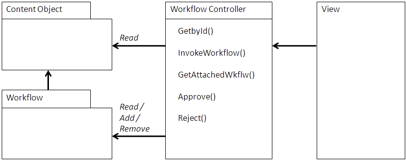

# Review and Approval workflow

A Review and Approval workflow is similar to a Project Space but is more focused on tracking the review of critical documents in a review process.

The workflow takes an artifact and delivers it to key responsible people for review, and then either approval or rejection. The workflow also provides an audit trail of the decisions made. As with the Project Space, the business application may lack a workflow capability and a repository to track the artifacts of the business process. A Review and Approval workflow demonstrates that key documents and deliverables have been signed off by those responsible for the end result, either for regulatory or operational efficiency reasons.

## Using a Review and Approval workflow

A workflow is built using jBPM either in XML or using the Eclipse-based workflow design tool for jBPM. One or more workflows can be made available for use. The easiest way to assign the workflows is to use a rule in a space in an archive dedicated to processing the contents of the business application. Alternatively, the application can initiate the workflow using a web script upon entry in the archive. Using the Attachment pattern, you can add the content to the business object and then the workflow is initiated on that document.

The workflow then manages the process of Review and Approval. The content is delivered to the end user via email. The user can then track items that need action through the Alfresco clients or a portlet. You can also configure the Alfresco system to send reminders if necessary.

Aspects can track status. This aspect should have the status and the identifier of the workflow to allow action on that workflow if necessary. This status can be inspected by the application to indicate whether the document is ready for use or not and whether it has been processed and edited properly. The attachment can then indicate the current status of its associated workflow through that aspect so that the status persists beyond the life of the workflow. A Query view that queries the status of currently active documents for review can also track status.

## When to use a Review and Approval workflow

When an application must provide documentation that procedures and policies are being followed, a Review and Approval workflow can demonstrate that the appropriate reviews have been taken by those responsible. This is often required for compliance with regulatory authorities, such as for Sarbanes-Oxley, and for industry certification, such as ISO 9000.

## Example: Kofax

Microstrategies used the rules and actions capabilities of Alfresco in the Kofax example shown in the Archive example. As part of the repository setup, the spaces that the images are stored in are assigned a workflow for any new images coming in. As soon as the images are added, the rule associated with new items assigns a quality control workflow that puts the image through a workflow and assigns the image to the appropriate person. No coding was necessary.

**Parent topic:**[Content management integration patterns](../concepts/integration-patterns.md)

