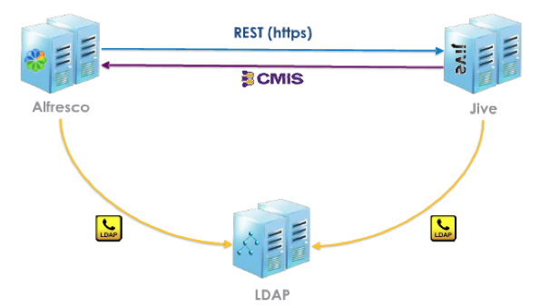

# Alfresco Jive Toolkit architecture

This section describes the Alfresco Jive Toolkit architecture.

The Jive Toolkit integrates Alfresco Enterprise \(Versions 3.4.3 or 3.4.4, 3.4.5, 3.4.6, and 3.4.7\) and Jive Engage 5.0.1.0 using the Content Management Interoperability Services \(CMIS\) standard – an Enterprise Content Management specification that Alfresco supports.

When the Jive Toolkit is installed, the Alfresco Share user interface is updated with a new function within the Document Library. This function is a new menu option called **Socialize**. The function allows you to select one or more documents in the Document Library, and then socialize them to a Jive community.

The architecture of the Jive Toolkit is structured so that Alfresco may be installed on one server, and Jive may be installed on a another server. The Jive Toolkit supports authentication using a shared LDAP server.

**Parent topic:**[Alfresco Jive integration overview](../concepts/jive-overview.md)

