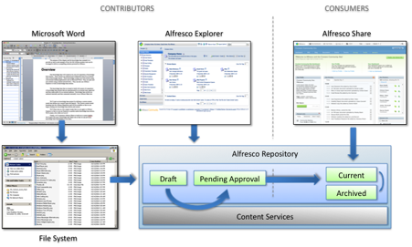

# Getting started

This section focuses on the Alfresco repository and Alfresco Explorer and walks through the design and implementation of the required content model and rules to implement a lifecycle for Knowledge Base articles.

The Knowledge Base contains articles contributed by internal knowledge experts. External consumers of the articles expect them to contain valid and approved information. Content contributors can author new articles or work on existing articles using authoring facilities in Alfresco. They can use Alfresco Explorer to navigate the content hierarchy to find and work on articles, or use conventional desktop applications, such as Microsoft Word, to open and save files directly against Alfresco through its CIFS interface.

All articles have a lifecycle state. When first authored, an article has a “draft” status, signifying that its content has not yet been approved. It may require more work before it is complete, or it may just need someone to sign off on its validity. The workflow engine routes the article to the appropriate people for sign-off and approval and during this time the article is assigned a “pending approval ”status. As a positive outcome of this workflow process, the article’s status is modified to an approved “current” state. An article with this status is valid and the external consumer audience can retrieve it. Alternatively, the workflow process may discover a problem with the article. In that case, it sets the article’s status back to “draft” and allows the internal staff to continue making modifications.

The following figure shows an overview of this workflow process.

-   **[Defining a content model for metadata](../tasks/kb-model-define.md)**  
A content model for Knowledge Base metadata requires a namespace URI and prefix.
-   **[Configuring Alfresco Explorer extensions](../concepts/kb-explorer-ext.md)**  
Alfresco Explorer provides a useful interface for content contributors, letting them use it to create new Knowledge Base articles and adjust metadata properties using automatically rendered property sheets. Alfresco Explorer features a number of configurable options for working with your Knowledge Base spaces and articles.
-   **[Stopping the Alfresco server](../tasks/alfresco-stop.md)**  
This section describes how to stop the Alfresco server.
-   **[Adding the Knowledge Base content model](../tasks/kb-code-model-add.md)**  
Introducing the Knowledge Base content model to the Alfresco repository informs Alfresco how to deal with your Knowledge Base content types and aspects.
-   **[Adding Alfresco Explorer configuration](../tasks/kb-code-explorer-add.md)**  
Plugging in your Alfresco Explorer configurations enables the additional property sheets, wizards, and icons for your Knowledge Base space content type and Knowledge Base aspects.
-   **[Adding the Knowledge Base Search web script](../tasks/kb-code-search-script.md)**  
This installs the Knowledge Base Search web script into the Alfresco repository.
-   **[Starting the Alfresco server](../tasks/alfresco-start.md)**  
The server must be running before you can use Alfresco Share or Alfresco Explorer. When you install Alfresco using the setup wizard, the server is automatically installed and started as a service.
-   **[Signing on to Alfresco Explorer](../tasks/kb-login.md)**  
Use Alfresco Explorer to set up the Alfresco Knowledge Base workspace.
-   **[Adding a script to the Data Dictionary](../tasks/kb-custom-script-install.md)**  
You can place your custom script files, such as your custom server-side JavaScript file in the Data Dictionary in the Alfresco repository.
-   **[Creating a Knowledge Base space template](../tasks/kb-space-template-create.md)**  
Creating a Knowledge Base space template inside Alfresco Explorer lets you quickly stamp out preconfigured workspaces that implement all your Knowledge Base functionality.
-   **[Creating a Knowledge Base](../tasks/kb-create.md)**  
Using your Knowledge Base space template, you can stamp out Knowledge Base workspaces. This example creates a test space under Company Home.
-   **[Creating and contributing an article](../tasks/kb-article-create.md)**  
You can create a Knowledge Base article and contribute it to your Knowledge Base using either Alfresco Explorer or CIFS desktop integration.
-   **[Editing a Knowledge Base article](../tasks/kb-article-edit.md)**  
Modify the properties of a Knowledge Base article in Alfresco Explorer.
-   **[Viewing content in JSON](../tasks/kb-json-fetch.md)**  
You can use Alfresco Explorer and/or desktop integration via CIFS to create and modify Knowledge Base articles. All these articles are stored in the Alfresco repository as pure content objects with metadata, aspects, and content types. You can also fetch this content via HTTP by calling into your Knowledge Base web script. The HTTP interface lets third-party systems or external applications \(such as Alfresco Share\) interact with your Knowledge Base and interrogate the data inside.

**Parent topic:**[Building a custom Knowledge Base application](../concepts/kb-getting-started-overview.md)

