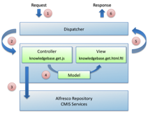

# Building custom dashlets

The site dashboard displays when users arrive to a site, and contains dashlets. A dashlet offers a quick view into the content or activities of the site. You can use the out-of-the-box dashlets or add your own custom dashlets.

A dashlet build typically includes a scriptable controller and a view template file that bind to the GET method and HTML format using the following type of naming convention:

-   JavaScript controller: `knowledgebase.get.js`
-   FreeMarker template: `knowledgebase.get.html.ftl`

When invoking a web script:

1.  The web script dispatcher receives a request for the dashlet.
2.  The dispatcher calls the JavaScript controller \(if available\).
3.  The controller opens up a connection to the Alfresco repository and uses a RESTful interface or the CMIS interface to retrieve XML or JSON as pure data.
4.  The controller populates the model with the data needed to render.
5.  The dispatcher calls the view to render HTML markup.
6.  The dispatcher hands the markup back to the requester.

In this case, the requester is the Alfresco Share page renderer. The dashlet renders into the site dashboard page where the site manager instructed it to appear.

-   **[Configuring a dashlet as an option on the site dashboard](../tasks/kb-dashlet-configure.md)**  
A dashlet consists of a Spring web script. Modifying the dashlet's web script descriptor lets it display as an option on the Alfresco Share site dashboard configuration screen.

**Parent topic:**[Customizing Alfresco Share \(basic\)](../concepts/kb-share-customize-about.md)

