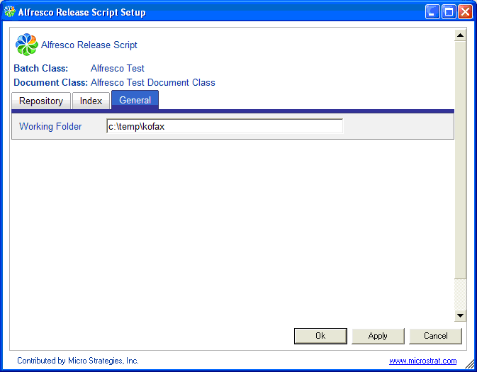

# General tab

The General tab defines the working folder used by Kofax Capture for temporary file storage during the release process.

-   **Working Folder**

    Set this to a folder where the user running the script has write access on the local Kofax Capture machine.

**Parent topic:**[Alfresco Kofax Release script configuration tabs](../concepts/kofax-relscript-config.md)

