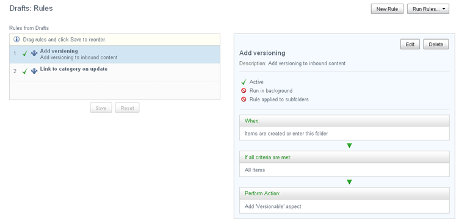

# Working with a defined rule set

Manage the defined rule set on a folder to add, delete, and edit individual rules; mark a rule as inactive; and change the order in which the rules are run. You can also manually run rules.

When the selected folder has defined rules the **Manage Rules** action displays the Rules page as follows:

The left side of the page lists the rules that make up the rule set for the selected folder. When the selected folder inherits rules from a parent folder, those rules also appear on this page. The rules are run in the order listed; inherited rules are always run first. A check mark to the left of the rule indicates it is active. The currently selected rule is highlighted.

The right side of the page displays the details for the currently selected rule.

-   **[Creating a new rule](../tasks/library-folder-rules-new.md)**  
A rule set can contain any number of rules. Create new rules for the current rule set as necessary.
-   **[Editing a rule](../tasks/library-folder-rules-edit.md)**  
From the Rules page you can easily update individual rules for the current rule set. In addition to changing the rule definition, you can use this feature to disable a rule that you do not want to run as part of the current rule set.
-   **[Deleting a rule](../tasks/library-folder-rules-delete.md)**  
If you no longer need a rule, you can delete it from the rule set. If there is a chance you might need the rule again, you may prefer to edit the rule and simply disable it.
-   **[Reordering the rules in the rule set](../tasks/library-folder-rules-reorder.md)**  
As part of managing your rule set, you can specify the order in which the rules are run. Rules marked as inactive will simply be skipped. If the selected folder includes inherited rules, those will be run first in the order displayed.
-   **[Running rules](../tasks/library-folder-rules-run.md)**  
When you create or edit a rule set for a folder that already contains content, the rules are not applied to the existing content. The **Run Rules** feature allows you to manually run the rule set on the folder to ensure the existing content is included. You have the option of running the rules on only the current folder or on the folder and its subfolders.

**Parent topic:**[Managing rules](../tasks/library-folder-rules-manage.md)

