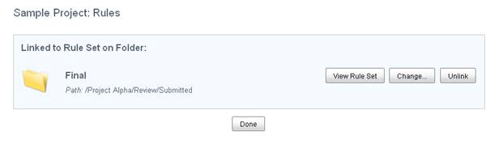

# Working with linked rules

Manage the linked rules on a folder to change the link to a different rule set or break the link completely.

When the selected folder is linked to the rule set of another folder the **Manage Rules** actions displays the Rules page as follows:

This page displays the name and path of the folder whose rule set is being referenced. From here you can change the link to a different rule set or break the link completely.

**Note:** The selected folder may also inherit rules from a parent folder. If this is the case a message appears on this page.

Changes to this rule set, such as adding, editing, and removing individual rules, must be done in the folder where they were defined. Click **View Rule Set** to display the Rules page for the source folder.

-   **[Linking to a different rule set](../tasks/library-folder-rules-change-link.md)**  
When a folder is linked to the rule set of another folder, you can change the association at any time by linking to a different rule set.
-   **[Breaking the link to a rule set](../tasks/library-folder-rules-break-link.md)**  
When a folder is linked to the rule set of another folder, you can break the association at any time. This leaves the folder without rules.

**Parent topic:**[Managing rules](../tasks/library-folder-rules-manage.md)

