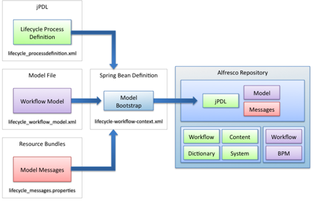

# Process definitions

Alfresco provides the jBPM workflow engine out of the box, which empowers solution developers to model business processes around content. Workflow provides you with the ability to design lifecycle management around your content.

A process definition is written in jPDL and bootstrapped into the Alfresco repository at startup by a separate Spring bean. Along with the process definition, the Spring bean can also optionally bootstrap a workflow content model as well as any I18N resource bundles \(`properties` files\) to support localization. Alfresco provides the jBPM workflow engine out of the box for modeling business processes around content.

Here is a sample process definition that defines a content lifecycle.



The `lifecycle-workflow-context.xml` file defines the Spring bean that bootstraps the three other files into the repository:

```
<?xml version=’1.0’ encoding=’UTF-8’?>
<!DOCTYPE beans PUBLIC ‘-//SPRING//DTD BEAN//EN’ ‘http://www.springframework.org/
dtd/spring-beans.dtd’>
  <beans>
   <bean id="lifecycle.workflowBootstrap" parent="workflowDeployer">
    <property name="workflowDefinitions">
      <list>
       <props>
         <prop key="engineId">jbpm</prop>
         <prop key="location">
           alfresco/extension/lifecycle_processdefinition.xml
         </prop>
         <prop key="mimetype">text/xml</prop>
         <prop key="redeploy">false</prop>
        </props>
       </list>
     </property>
      <property name="models">
        <list>
          <value>alfresco/extension/lifecycleModel.xml</value>
        </list>
      </property>
      <property name="labels">
       <list>
          <value>alfresco/extension/lifecycle-messages</value>
       </list>
    </property>
  </bean>
</beans>
```

**Parent topic:**[Alfresco repository extension points](../concepts/customize-overview.md)

