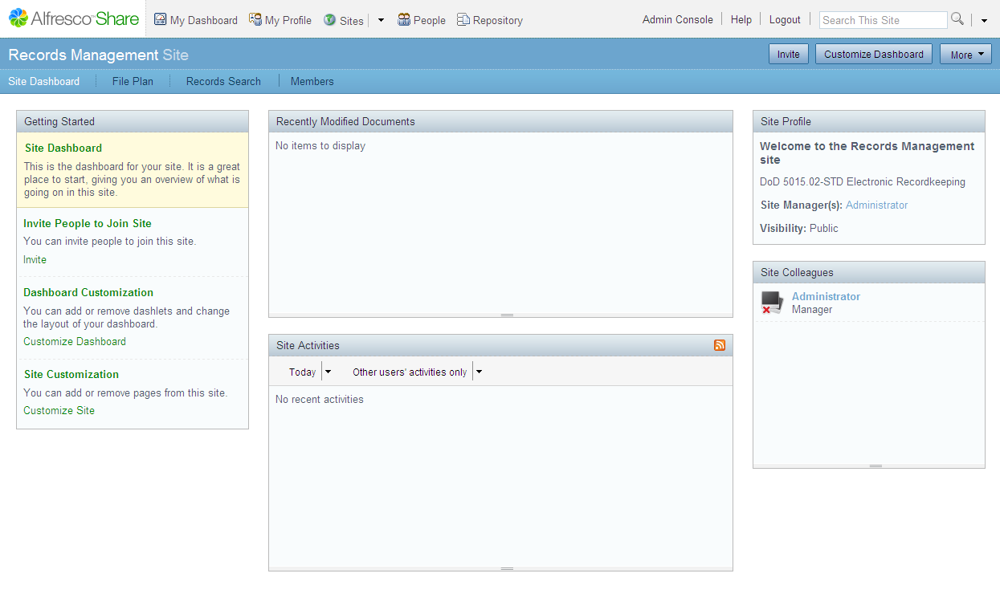

# Records Management site

The Records Management site consists of dashlets that allow you to track the activities that are relevant to the records management life cycle.

**Parent topic:**[Log in](../tasks/rm-login.md)

**Parent topic:**[Getting started](../concepts/rm-gettingstarted.md)

