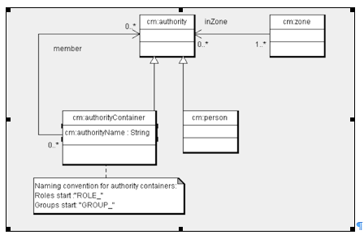

# Zones

All person and group nodes are in one or more zones. You can use zones for any partitioning of authorities. For example, Alfresco synchronization uses zones to record from which LDAP server users and groups have been synchronized. Zones are used to hide some groups that provide Role Based Access Control \(RBAC\) role-like functionality from the administration pages of the Alfresco Explorer and Alfresco Share web clients. Examples of hidden groups are the roles used in Alfresco Share and Records Management \(RM\). Only users and groups in the default zone are shown for normal group and user selection on the group administration pages. Zones cannot be managed from the administration pages of Alfresco Explorer and Alfresco Share.

Zones are intended to have a tree structure defined by naming convention. Zones are grouped into two areas: Application-related zones and authentication-related zones.

Within a zone, a group is considered to be a root group if it is not contained by another group in the same zone.

Alfresco uses a model for persisting people, groups, and zones. A Person node represents each person, and an AuthorityContainer represents groups, which can be used for other authority groupings such as roles. AuthorityContainer and Person are sub-classes of Authority and as such can be in any number of Zones.

-   **[Application-related zones](../concepts/secur-zones-apprelated.md)**  
Application-related zones, other than the default, hide groups that implement RBAC like roles. Application zones, by convention, start APP. and include:
-   **[Authorization-related zones](../concepts/secur-zones-authrelated.md)**  
Zones are also used to record the primary source of person and group information. They may be held within Alfresco or some external source. While authorities can be in many zones, it makes sense for an authority to be in only one authentication-related zone.

**Parent topic:**[Authorities](../concepts/secur-authorities.md)

