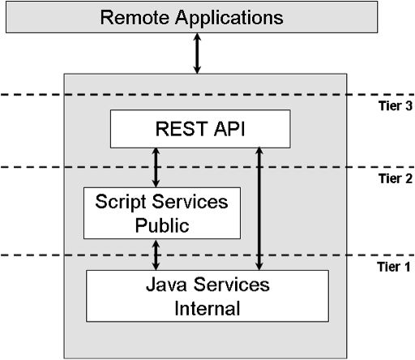

# Building Alfresco services

Alfresco services are typically built using three tiers: core Java, a public script service, and a RESTful API.

Each tier generally has the following characteristics:

**Tier 1 — Embedded Java API**

This is a low level, stateless API implemented in Java, encapsulating all the functionality provided by the service and is typically a collection of fine-grained, stateless methods. It is considered an internal API only suitable for core Java developers. All other interfaces are built on top of these APIs. Examples include the File Folder service, Search service, and Authentication service.

**Tier 2 — JavaScript API**

This is an object-based interface on top of the embedded Java API, providing a developer-friendly interface to the server capabilities. Example methods available include `createNode`, `createAssociation`, `setPermission`, and `query`. Scripts can implement independent behaviors through actions and provide the backing behavior for web scripts when implementing the RESTful APIs.

**Tier 3 — RESTful API**

This is designed around resources and data to provide a remote, URL-based API that can be called from virtually any language. Typically built on top of the Public Script services, they can also be implemented directly on the Java API. Examples include the Sites service and Tagging service, both of which are implemented on top of associated Script services.

You can implement services using just one or two of the layers. For example, some low level services are only available at the core Java level for use as a component of a higher-level service.

-   **[Building a simple service](../tasks/serv-build.md)**  
This example describes how to build a new service showing the high level interfaces for each tier of the service.

**Parent topic:**[Configuring and extending Alfresco services](../concepts/serv-using-about.md)

