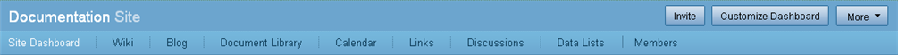

# Site Dashboards

A site is a collaborative area within Share to which you can invite users for the purpose of sharing and collaborating on content. By default, sites include Wiki, Blog, Document Library, Calendar, Links, Discussion Forum, and Data Lists page components. You can customize each site to contain any combination of these components.

When you enter a site, the site dashboard is displayed.

The site banner beneath the application toolbar displays the name of the selected site. Buttons to the right of the site name—**Invite**, **Customize Dashboard**, and **More**—enable the Site Manager to manage the site.

**Note:** For users with a role other than Site Manager, the banner displays only an **Actions** button.

Beneath the site name, the **Site Dashboard** link is highlighted, indicating it is the current page component. To the right of this are links for the page components included in this site. The banner also includes the **Members** link for managing the site membership.

The site dashboard consists of site dashlets, which organize and display information that is relevant to the site. When you customize the site dashboard, you can specify the desired dashlets; each dashlet selected displays as a pane on the dashboard.

The available site dashlets are:

-   **Getting Started**

    The Getting Started dashlet displays helpful information for getting started in the site and provides links to perform common tasks.

-   **Site Profile**

    The Site Profile dashlet contains a summary of the personal details provided in your full user profile.

-   **Site Colleagues**

    The Site Colleagues dashlet lists the site members \(to a maximum of 100 members\) and their assigned roles.

-   **Site Calendar**

    The Site Calendar dashlet contains a rolled-up view of events for this site.

-   **Site Activities**

    The Site Activities dashlet tracks the most recent activities that have been performed in this site.

-   **Recently Modified Documents**

    The Recently Modified Documents dashlet displays documents in this site's Document Library that have been added or edited in the past seven days.

-   **Site Wiki**

    The Wiki dashlet displays the specified wiki page. The **Configure** link on the dashlet enables the Site Manager to select the desired page. Click the name of the wiki page in the dashlet header to display that page in the Wiki page component.

-   **Site Links**

    The Site Links dashlet displays the web links compiled by site users that are relevant to the current site. On this dashlet you can open a link, view the link details, or create a new link \(click **Create Link**\).

-   **Image Preview**

    The Image Preview dashlet displays a thumbnail of all images contained in the site's Document Library.

-   **RSS Feed**

    The RSS Feed dashlet, by default, is configured to display the Alfresco website feed.

-   **Web View**

    The Web View dashlet can be configured to display any website.

-   **Site Data Lists**

    The Site Data Lists dashlet displays a list of the existing data lists for the current site. Click the name of a list in this dashlet to display that list in the Data Lists page component.

-   **Web Quick Start**

    The Web Quick Start dashlet enables you to use the Web Quick Start sample web application. The dashlet initially displays a link that imports the Web Quick Start demo data. Once the import is complete, the dashlet displays a link to the Web Quick Start online help. This dashlet is available only when the Web Quick Start demo is installed.

In sites for which you are a Site Manager, a resizing bar appears on the bottom edge of most dashlets, enabling you to adjust the height as desired.

-   **[Marking the current site as a favorite](../tasks/sites-favourites-menu.md)**  
Marking a site as a favorite enables you to easily access it from the **Sites** menu and on the My Sites dashlet. You can tag any number of sites this way.
-   **[Customizing a site](../tasks/site-customize.md)**  
Customizing a site enables you to choose the page components you want to include for the site. By default, all components—Wiki, Blog, Document Library, Calendar, Links, Discussions, and Data Lists—are included when you create a site. Only the Site Manager can customize the site. Once you customize the site, you can customize the site dashboard, which provides a summary of the available page components.
-   **[Customizing a site dashboard](../tasks/site-customize-dashboard.md)**  
The site dashboard is an interactive user interface that contains information specific to the current site. Like your personal dashboard, site information is organized and displayed in dashlets, which represent the configured page components.
-   **[Editing the site details](../tasks/sites-edit-details.md)**  
Once you create a site, you can edit the name and description from anywhere in the site. You can also change the access \(public or private\) for the site. Only the Site Manager can edit the site details.
-   **[Configuring the site dashboard RSS feed](../tasks/site-configure-rss.md)**  
 You can configure the RSS Feed site dashlet to display any RSS feed on a site dashboard.
-   **[Configuring the Wiki site dashlet](../tasks/site-customize-wiki.md)**  
Configure the Wiki site dashlet to display the content of a specific wiki page.
-   **[Subscribing to an RSS feed](../tasks/site-subscribe-rss-feed.md)**  
Throughout the application, you have the opportunity to subscribe to RSS feeds. These feeds enable you to automatically receive regular updates on various Share activities.
-   **[Configuring the Web View site dashlet](../tasks/site-configure-webview.md)**  
You can configure the Web View site dashlet to display any website on a site dashboard.
-   **[Tagging site content](../tasks/site-content-tag.md)**  
Throughout Share, you can use tags to categorize similar or related content across page components within a site. This enables you to easily locate the content again.
-   **[Selecting a page component](../tasks/page-select.md)**  
The site banner displays the page components included in the site. Once you enter a site, you can navigate between the page components to view information and perform functions on the site content.

**Parent topic:**[Using Alfresco Share](../topics/sh-uh-welcome.md)

