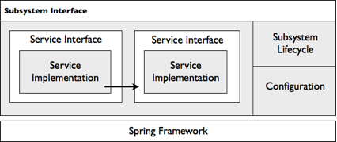

# Modularity

The Alfresco system is modular. Every moving part is encapsulated as a service, where each service provides an external face in a formally defined interface and has one or more black-box implementations.

The system is designed this way to allow for:

-   Pick and mix of services for building an ECM solution
-   Reimplementation of individual services
-   Multiple implementations of a service, where the appropriate implementation is chosen based on the context within which the solution is executed
-   A pattern for extending Alfresco \(at design and runtime\)
-   Easier testing of services

To support this approach, Alfresco used the Spring framework for its factory, Dependency Injection, and Aspect-Oriented Programming capabilities. Services are bound together through their interfaces and configured using Spring’s declarative Dependency Injection.

A service interface is defined as a Java interface. For services that form the internal embedded API for extensions, cross-cutting concerns such as transaction demarcation, access control, auditing, logging, and multi-tenancy are plugged in through Spring AOP behind the service interface. This means that service implementations are not polluted with these concerns. It also means the cross-cutting concerns may be configured independently or even switched off across the server if, for example, performance is the top-most requirement and the feature is not necessary.

Multiple services are aggregated into an Alfresco subsystem where a subsystem represents a complete coherent capability of the Alfresco server, such as authentication, transformation, and protocols. As a unit, subsystems have their own lifecycle where they may be shut down and restarted while the Alfresco server is running. This is useful to disable aspects of the server, or reconfigure parts of it, such as how LDAP synchronization is mapped. Each subsystem supports its own administration interface that is accessible through property files or JMX.

**Parent topic:**[Architecture](../concepts/alfresco-arch-about.md)

