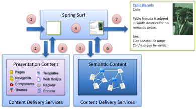

# Surf content

In Surf, content refers to dynamic information or data that a web application looks to at runtime to decide what to render or how to render.

Information from a real-time feed, such as an RSS feed, fall into this category. Such content describes what to render into the user interface, for example, news articles. However, Java code or Spring context files are not dynamic content since they are resolved once \(at compile time and during application context startup, respectfully\). The server must be restarted for any changes to be picked up.

A Spring Surf web application architect is concerned with two kinds of dynamic content: semantic content and presentation content. These tell Surf what to render and how to render.

## Semantic content

Semantic content comprises documents or files that describe business-generated content. This content is authored, approved, and published.

The following items are examples of semantic content:

-   An approved press release for display on the home page
-   A Knowledge Base article that has been tagged and appears on several different pages of the website
-   A product inventory descriptor that includes images, thumbnails, and references to product documentation

Semantic content describes what should be rendered. It contains the approved message but it does not contain any formatting information. It is represented in a structured data format, such as JSON or XML. The following code is an example of JSON text for a biography:

```
{ 
"author": "Pablo Neruda", 
"country": "Chile", "image": "pablo_neruda.jpg", 
"description": "Pablo Neruda is adored in South America for his romantic prose.", 
"popular_works": ["Cien sonetos de amor", "Confieso que he vivido"] 
}
```

This code does not contain any formatting like HTML tags or other markup, just simple data. You publish this semantic content to a website and then let the website managers display it the way they want.

## Presentation content

Presentation content are documents and files that describe presentation configuration for a website. Presentation content comprises configuration that tells the Surf rendering engine how the web page or page component should look and feel.

Presentation content answers questions like:

-   Which theme to use to render the website’s home page
-   How many articles to display on the front page
-   Which advertisement to display in a particular section of the site for the current user

Presentation content is information specific to a website user interface, and determines how to render things. A website presentation framework, such as Surf, looks to this content to figure out what to do. For example, the following XML code configures a Surf web script for rendering a biography to end users and tells the web script to render a link to the full article as well as to show the image of the author.

```
<component> 
  <url>/content/display/biography</url> 
  <properties> 
<link-title-to-full-article>true</link-title-to-full-article> 
    <show-image>true</show-image> 
  </properties> 
</component> 
```

This XML tells the web script how to render the biography. The end-to-end rendering flow is illustrated in the following figure.



This figure depicts a simple request for a biography of a poet. Here is what happens.

1.  Spring Surf receives the browser request.
2.  Surf asks the content delivery services for the presentation content that describes what is being requested.
3.  The presentation content is handed back as XML.
4.  Surf determines the web script to execute using the configuration specified by the XML.
5.  The web script calls to the content delivery services and asks for biography data.
6.  The biography is returned as JSON.
7.  The web script renders HTML markup to the end user. This HTML contains presentation output \(formatting\) as well as the semantic data \(the biography itself\).

The website user then sees the poet's content.

**Parent topic:**[Working with the Surf framework](../concepts/surf-fwork-intro.md)

