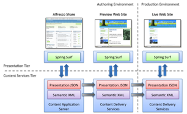

# Content applications

Surf maintains a content-driven and scriptable approach to web application delivery, and interoperates well with Alfresco Web Content Management.

Alfresco provides facilities to define, contribute, and manage lifecycle for both semantic and presentation content, providing a number of WCM capabilities around content, such as:

-   Managed lifecycle from origination to disposition object or attribute-level authority for users, groups, or roles
-   Deployment of content from an approved environment to all Surf applications in the delivery tier
-   Rendering content into alternative delivery formats

Alfresco Web Content Management lets you define content lifecycle for a Surf application’s semantic and presentation content. It allows you to author content in an authoring environment and publish that content out for consumption to a delivery environment.

For example, in the following figure:

-   A full content services configuration for Surf is shown on the right side. This is your live website. All the content for a site \(both semantic and presentation\) is retrieved from the live website’s content delivery services. This website runs in the production environment and its users are live web traffic users. The production environment is, therefore, sized and configured to scale for live web traffic needs.
-   The authoring environment consists of a preview website and Alfresco Share, the web interface to the content application server for authoring and saving content into the content application server.
-   The gray arrows along the bottom indicate deployment. Alfresco Web Content Management provides deployment for Surf presentation objects and semantic content. Content contributors can create content using Alfresco Share and the Alfresco content server and then instantly preview their content to see how it might look if it were part of the actual website.
-   A contributor wrote the biography for Pablo Neruda and elected to preview it. The content was published to the content delivery services for the preview website. Surf picks up these changes automatically and shows the contributor what the biography looks like in context with the rest of the page. It only shows this on the preview website; the live website is not affected by the preview. If Surf’s in-context editing features were enabled, users could make changes to the content on the website. If not, they can make changes to the content within the content application server using Alfresco Share and deploy it to the production environment when they are ready.

You can configure this any number of ways. Deployment transports the content from the content application server to the content delivery services for a website. This is usually done for integration testing, quality assurance, preview, and ultimately for delivery to a live website.

Alfresco authoring facilities are ideal for working with both semantic and presentation content, which include Alfresco Share, the Alfresco Forms Service for content contribution, CIFS for desktop and file system interaction, and Microsoft Office/SharePoint integration.

While the Alfresco content delivery services are excellent for Spring Surf, they are not proprietary to Spring Surf and are web framework agnostic. They provide a CMIS interface to the outside world. As an open standard, CMIS works equally well across many platforms and you can use it to support web applications built in Java, PHP, .NET, Python, and more. The Alfresco content application server works hand-in-hand with Spring Surf to manage and deploy both presentation and semantic content to Spring framework websites.

**Parent topic:**[Working with the Surf framework](../concepts/surf-fwork-intro.md)

