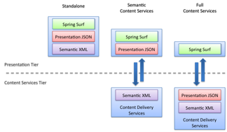

# Content delivery services

Surf connects to content delivery services to provide content retrieval and query for presentation and semantic content.

This means that Surf applications can consist of either single-tier or dual-tier applications. The following figure shows three valid configurations for Surf. The standalone configuration on the left shows, all the presentation and semantic content stored as part of the Surf web application. It is self-contained and has everything that it needs so that requests can be services entirely from the web application in the presentation tier. This is a perfectly acceptable configuration. Surf imposes no requirements, it does not require a database, any local persistence, or even a user session.

A more interesting scenario is the full content services configuration on the right, where the Surf application lives in the presentation tier but relies upon content delivery services in the content services tier to hand it data so that it can respond to incoming requests. This data consists of things like the biography or web script configuration information. In this case, Surf provides developers with connector and credential management so that interactions with the content delivery services can be performed on behalf of the end user. Surf provisions connectors to web script developers so they can retrieve feeds of data. This data is often represented in either JSON or XML, but it could also be in any number of other formats. Developers work with these feeds and render them back through view templates. Surf focuses on view caching and render performance to minimize the number of remote calls needed on each request.

Surf also has native support for the CMIS standard \(Content Management Interoperability Services\), an industry-adopted API for talking to ECM systems. Alfresco ECM provides the leading open-source CMIS implementation, as well as an entire suite of tools around CMIS authoring and delivery. Surf is an ideal presentation technology for CMIS content delivery.

Surf developers have the option to independently scale out the presentation tier from the content services tier. The presentation tier is primarily developed with the intention of scaling to user load, while providing quick end-user responses, whereas the content services tier scales to content retrieval and query. A single page hit to the Surf application could result in several content services hits, a single hit, or no hits at all depending on the application design.

**Parent topic:**[Working with the Surf framework](../concepts/surf-fwork-intro.md)

