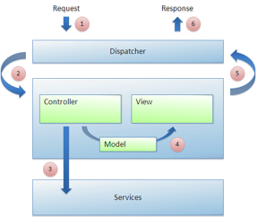

# Model-View-Controller

MVC applications use a dispatcher to handle requests for an application. It looks at the URL to determine which controller to invoke to set up a model, and then which view to invoke to render the model.

The dispatcher uses mappings \(usually URL mappings\) to determine which controllers to invoke for the incoming URL. It also uses mappings to figure out which view to invoke to render the response back. A controller contains business logic that should run before the response is generated. It can do things like query a database or call out to a service. Its job is to place this data into the model. A view contains rendering logic responsible for building the response that the end user receives. It looks to the data in the model to inform its rendering process.

The following figure illustrates the process:

1.  The dispatcher handles an incoming request. Imagine that the incoming URI is /hotels.
2.  The dispatcher tries to find a matching controller for this URI.
3.  A controller is invoked if found. The controller calls out to some services to retrieve a list of hotels, creates a model, and then places this list of hotels into the model.
4.  The dispatcher tries to find a matching view for this URI.
5.  A view is invoked if found. The view receives the model and uses it to render HTML markup that displays the list of hotels.
6.  The response is sent back to the end user.

The main benefit of the MVC pattern is that it clearly separates the business and rendering logic. This modularizes your application architecture, allowing you to plug in new views and new controllers. It provides reuse, as many views can share a single controller, or many controllers can share a single view.

**Parent topic:**[Working with the Surf framework](../concepts/surf-fwork-intro.md)

