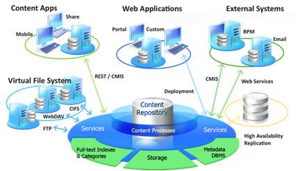

# Overview

Alfresco is an open source Enterprise Content Management \(ECM\) system that manages all the content within an enterprise and provides the services and controls that manage this content.At the core of the Alfresco system is a repository supported by a server that persists content, metadata, associations, and full text indexes. Programming interfaces support multiple languages and protocols upon which developers can create custom applications and solutions. Out-of-the-box applications provide standard solutions such as document management, records management, and web content management.

As an entirely Java application, the Alfresco system runs on virtually any system that can run Java Enterprise Edition. At the core is the Spring platform, providing the ability to modularize functionality, such as versioning, security, and rules. Alfresco uses scripting to simplify adding new functionality and developing new programming interfaces. This portion of the architecture is known as web scripts and can be used for both data and presentation services. The lightweight architecture is easy to download, install, and deploy.

-   **[System paths](../reuse/conv-syspaths.md)**  
This section describes the conventions for common system paths.
-   **[Alfresco applications](../concepts/apps-about.md)**  
 Alfresco applications are built on the content application server and rely on the server to persist, access, query, and manage content.
-   **[Content applications](../concepts/apps-content-about.md)**  
 Alfresco can be used for building most ECM applications. Aside from the major applications such as document, image, records, digital asset, and web content management, there are a number of specific applications and use cases that add value to the enterprise.
-   **[Alfresco web tier and Surf](../concepts/surf-about.md)**  
Alfresco provides ECM capabilities as data services, user interfaces, and user applications. The user interface capabilities are provided by applications and application components using Alfresco’s web tier, Surf, originally developed as a faster way to develop content applications using scripting and REST architecture. Alfresco contributed Surf as a project to the Spring community for use with other Spring web tier components, such as Spring MVC, Spring Webflow, and Grails.
-   **[Alfresco programming models](../concepts/models-about.md)**  
A number of programming models are available for building an application using the Alfresco content application server.
-   **[Guiding design principles](../concepts/alfresco-principles.md)**  
Alfresco's founding engineers designed a product to support modern ECM requirements based on principles that are still in use today.
-   **[Architecture](../concepts/alfresco-arch-about.md)**  
There are many ways to slice and deploy Alfresco, however most deployments follow a general pattern. Ultimately, Alfresco is used to implement ECM solutions, such as Document Management \(DM\), Web Content Management \(WCM\), Records Management \(RM\), and Digital Asset Management \(DAM\). Across those solutions may also be elements of collaboration and search.

**Parent topic:**[Welcome](../concepts/welcome-infocenter.md)

