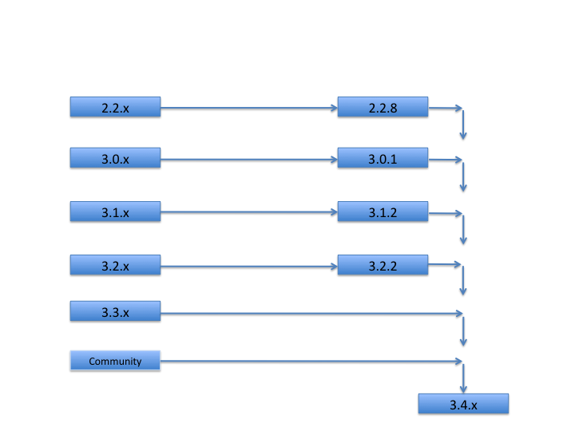

# Alfresco upgrade paths

When you upgrade Alfresco, it is recommended that you follow a structured upgrade path between versions.

Alfresco supports upgrading up to two major versions above your existing version. In the table, 3.x, 2.2, 2.1, and 2.0 are all considered to be major versions. This means that you can upgrade directly from 2.1 to 3.x; whereas 2.0 would require an intermediate step.

**Major version upgrades**

To upgrade to the latest version, first apply the latest service pack for your current version, then upgrade to the latest version \(including service pack\). The following diagram shows the upgrade paths for major versions:

For example, if your production environment currently runs Alfresco Version 2.2.2, you need to upgrade to Version 2.2.8 before you can upgrade to Version 3.4.14.

**Note:** If you are upgrading from an earlier release that is not shown on this diagram, contact Support for assistance.

**Minor version upgrades**

|From:|To:|
|-----|---|
|2.1 SP7; 2.2 SP8; 3.1 SP2; 3.2 SP1; 3.3|3.3 SP1|
|2.1 SP7; 2.2 SP7; 3.1 SP2; 3.2 SP1; Community 3.3|3.3|
|2.1 SP7; 2.2 SP7; 3.1 SP2; 3.2R|3.2 SP1|
|2.1 SP7; 2.2 SP6; 3.1 SP2; 3.2; Community 3.2|3.2r|
|2.1 SP7; 2.2 SP5; 3.1 SP2; Community 3.2|3.2|
|2.1 SP7; 2.2 SP5; 3.1 SP1|3.1 SP2|
|2.1 SP7; 2.2 SP4; 3.1|3.1 SP1|
|2.1 SP7; 2.2 SP3; 3.0 SP1; Community|3.1|
|2.1 SP6; 2.2; 2.2 SP2; 3.0|3.0 SP1|
|2.1 SP5; 2.2; 2.2 SP1; Community|3.0|
|Previous service pack, and latest service pack available from previous release.|2.2 - 2.2 SP8|
|2.1 SP5; 2.1 SP6|2.1 SP7|
|Previous service pack. For Legacy upgrades, Alfresco recommend engaging consulting.|1.2 - 2.1 SP4|

**Parent topic:**[Upgrading](../concepts/ch-upgrade.md)

