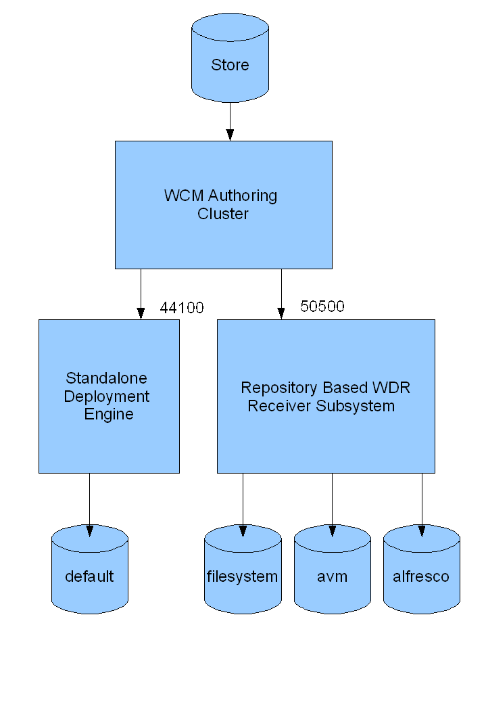

# Deploying from AVM

Deployment provides a framework for pushing content from an AVM authoring environment into another environment. For example you can push out content to a flat file system, to be served up by Apache or IIS, or to another instance of Alfresco.

The AVM authoring environment provides the facilities to produce an approved and consistent view of a web project called a snapshot. Deployment takes those snapshots and pushes them out to either live or test servers. The Deployment Engine receives deployments from an AVM authoring environment and delegates the contents of the deployment to the appropriate deployment receiver target. The deployment process may be automated so that it happens automatically when content is approved for publishing.

There are two implementations of the Deployment Engine:

-   Standalone deployment engine, which is a small lightweight framework that is independent of the Alfresco repository
-   Deployment engine, which is a subsystem within the Alfresco repository

Deployments are sent to the Deployment Engine, which delegates the deployment to the registered deployment targets. Deployment targets are registered using the Web Project wizard.

-   **[Deployment targets](../concepts/wcm-deployment-targets.md)**  
A deployment target is a named destination for a deployment. Alfresco deploys content through a deployment engine to a deployment target.
-   **[Filesystem deployment target](../concepts/wcm-targets-filesystem.md)**  
The file system deployment target deploys web content to a local file system. By default, there is a file system deployment target built into the standalone WCM\_Deployment\_Engine called `default` and also one included in the web delivery runtime subsystem called `filesystem`.
-   **[avm deployment target](../concepts/wcm-targets-avm.md)**  
The AVM Deployment Target is a target which is registered with the repository-based Deployment Engine. By default its target name is `avm` although this can be changed through configuration. The AVM Deployment Target receives a deployment from an AVM authoring environment and puts the content into an AVM store where it can be used to support a dynamic web site.
-   **[DM deployment target](../concepts/wcm-targets-alfresco.md)**  
The DM Deployment Target receives a deployment from an AVM authoring environment and puts the content into the workspace spaces store where it can be used to support a dynamic website.
-   **[Standalone deployment receiver](../concepts/wcm-deployment-standalone.md)**  
The Standalone Deployment Engine consists of a small server that receives updates from an Alfresco repository and publishes them to its deployment targets. It does not have the benefits of a full repository but is a small and tightly focused server.
-   **[Deployment Service properties](../concepts/dep-service-config.md)**  
The WCM deployment service is the client \(sending\) side of WCM deployment.

**Parent topic:**[Administering](../concepts/ch-administering.md)

