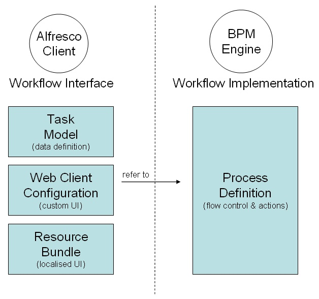

# Advanced workflow artifacts

An Alfresco "advanced" workflow comprises the following artifacts.

-   **[Administration features](../topics/wf-admin-features.md)**  
Three workflow administration features are available.
-   **[Implementation](../concepts/wf-implementation.md)**  
This section describes the way that workflow is implemented in Alfresco.

**Parent topic:**[Creating and managing workflows](../topics/wf-howto.md)

