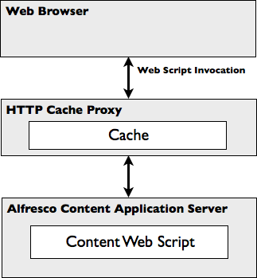

# Caching

A key aspect of HTTP is its ability to support caching of HTTP responses, relieving workload on the HTTP server, which does not have to re-create the HTTP response for every request. From a client perspective this gives a prompt response.

The Web Script Framework complies with HTTP caching, in particular with the notions of Last Modified Time and ETag \(a kind of hash\), allowing the caching of Web script responses using HTTP-aware caches.

**Note:** An ETag \(entity tag\) is a response header used to determine change in content at a given URL. Clients and caches use the ETag in subsequent requests to determine with the server if the content needs refreshing.

The Web Script Framework does not invent its own caching approach but relies on the caching protocol defined by HTTP. Each web script specifies how it is to be cached, which the Web Script Framework translates into appropriate HTTP headers when it is invoked. A third party HTTP cache that is deployed as part of the application then caches the web script response.

It is often necessary to cache the retrieval of content streams of documents residing in the Alfresco content repository as these can be large in size. A typical setup to support this scenario \(as shown in the following figure\) is to place an HTTP cache proxy between the client \(for example, a web browser\) and the Alfresco content application server.

A pre-built, out-of-the-box web script exists for retrieving the content stream of a document residing in the content repository. This web script is CMIS compliant and also specifies its HTTP caching requirements. With the HTTP cache proxy deployed, the content responses are cached intelligently and the cache is only updated when the content is updated in the content repository. This setup will also cache all other responses from web scripts that indicate how they are to be cached.

When developing a web script, you may specify its caching requirements, such as how long to keep the response in the cache or how to calculate the hash for the response. It is important to note that the Web Script Framework does not actually perform any caching. Instead, Alfresco relies on one of the many HTTP caches already available, such as Squid \(www.squid-cache.org\), an HTTP caching proxy. Therefore, you must either embed an HTTP cache in your client or deploy an HTTP-cache proxy in front of the Alfresco content application server to enable caching.

-   **[Runtime cache controls](../concepts/ws-runtime-cache-controls.md)**  
Some cache controls can be set only during the execution of a web script, such as setting when the content of the response was last modified. To support this, the Web Script Framework provides a special root object named `cache` to all controller scripts for allowing cache controls to be set at runtime.
-   **[Descriptor cache controls](../concepts/ws-desc-cache-controls.md)**  
When developing a web script, you can specify whether its response is to be cached and, if so, how it is to be cached through the web script descriptor document.
-   **[Creating a web script using cache controls](../tasks/ws-cache-using.md)**  
Caching is an important aspect of web scripts and is often required to support high-load applications such as Internet websites backed by the Alfresco content application server. You should consider caching when developing web scripts.

**Parent topic:**[Working with Alfresco web scripts](../concepts/ws-architecture.md)

**Related information**  

[Runtime cache controls](ws-runtime-cache-controls.md)

[Descriptor cache controls](ws-desc-cache-controls.md)

[Creating a web script using cache controls](../tasks/ws-cache-using.md)

