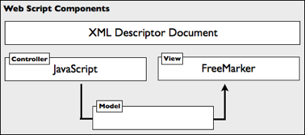

# Web script components

The Web Script Framework lets you create a web script using familiar technologies, such as scripting and template languages.

Each web script comprises only the following components:

-   A description document
-   An optional controller script
-   One or more FreeMarker response templates

Each component is implemented in its own file. The Web Script Framework dictates where the files are located and how they are named. This allows the framework to automatically locate and register web scripts without having to tell the framework where they are. In some cases, a web script may fall back to Java or rely on advanced Web Script Framework features where scripting alone cannot support the requirements of the web script.

Users of a web script only interact through the web script interface, which comprises its URI, HTTP method, and request/response document types. All of these are described in the web script description document, which is defined by the web script creator.

-   **[Web script description document](../concepts/ws-desc-doc.md)**  
A web script description document is an XML file that describes the URI and HTTP method that initiates the web script. For example, the web script is given a short name and description, along with authentication and transactional needs. URI bindings are described as URI templates.
-   **[Web script controller script](../concepts/ws-controll-script.md)**  
A web script controller script is a JavaScript file that contains the actual logic of a web script.
-   **[Web script response template](../concepts/ws-resp-template.md)**  
Known as views, web script response templates render output in the correct format for specific needs, such as HTML, Atom, XML, RSS, JSON, CSV, or any combination of these.

**Parent topic:**[Web Script Framework](../concepts/ws-framework.md)

**Related information**  

[Description document](ws-desc-doc.md)

[Controller script](ws-controll-script.md)

[Response template](ws-resp-template.md)

