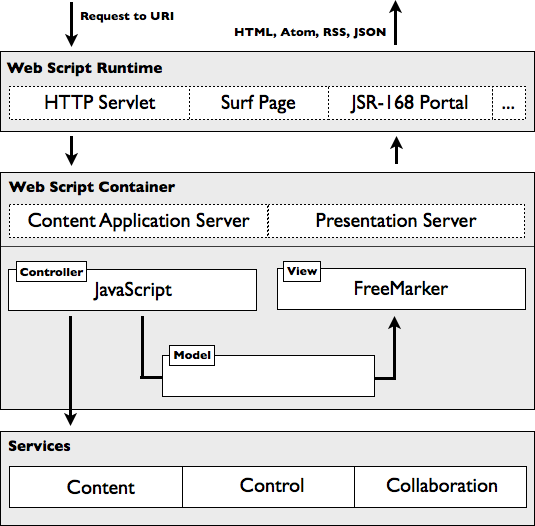

# Web Script Framework

The Web Script Framework is designed according to the Model View Controller \(MVC\) pattern \(sometimes referred to as MVC for the web\). While its primary design goal is to ensure that simple web scripts are easy to develop, advanced web scripts can support various features, such as rendering outputs in multiple languages, exposing and adhering to configuration options, and handling HTML form uploads.

You can call existing web scripts or create your own web scripts for new scenarios. For example, you can create your own web script to expose a RESTful interface onto a custom content repository extension.

-   **[Web script components](../concepts/ws-components.md)**  
The Web Script Framework lets you create a web script using familiar technologies, such as scripting and template languages.
-   **[Naming conventions](../concepts/ws-component-name.md)**  
Web script component file names adhere to the naming conventions defined by the Web Script Framework.
-   **[File locations](../concepts/ws-component-place.md)**  
Web script component files are located in the file system within the Java classpath or in the Alfresco content repository.
-   **[URI anatomy](../concepts/ws-anatomy.md)**  
Web scripts are invoked through their defined URIs. Every web script URI follows the same form.
-   **[URI template](../concepts/ws-uri-template.md)**  
A URI template is a URI containing tokens that may be substituted with actual values. Tokens may represent values to query parameters or values within the URI path where the syntax for expressing a token is \{`<token name>`\}.
-   **[Format readers](../concepts/ws-format-reader.md)**  
The Web Script Framework provides out-of-the-box format readers.
-   **[Response status code templates](../concepts/ws-resp-code-template.md)**  
Web scripts use response status code templates to render a custom response for a given status code. This is useful for providing unique information about a status code or to render a custom human readable interface.

**Parent topic:**[Working with Alfresco web scripts](../concepts/ws-architecture.md)

