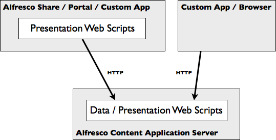

# Web script types

A web script is a service bound to a URI that responds to HTTP methods such as GET, POST, PUT, and DELETE.

There are two kinds of web scripts that use the same underlying code:

1.  Data web scripts
2.  Presentation web scripts

-   **[Data web scripts](../concepts/ws-types-data.md)**  
Data web scripts encapsulate access and modification of content/data held in the content repository; therefore, they are provided and exposed only by the Alfresco content application server.
-   **[Presentation web scripts](../concepts/ws-types-presentation.md)**  
Presentation web scripts let you build user interfaces. These include dashlets for Alfresco Explorer or Alfresco Share, portlets for a JSR-168 portal, UI components within Alfresco Surf, websites, or custom applications. They typically render HTML and may include browser-hosted JavaScript.

**Parent topic:**[Working with Alfresco web scripts](../concepts/ws-architecture.md)

