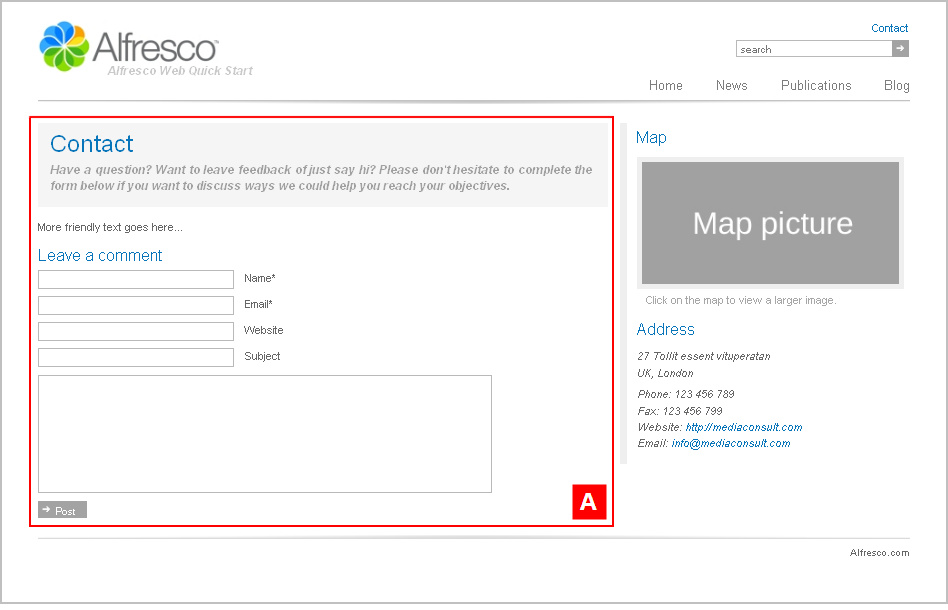

# contactpage1

The section **Alfresco Quick Start \> Quick Start Editorial \> root \> contact** has the template mapping `ws:article=contactpage1`.

This is a page displaying a contact form and company details. This template page has a two column layout.

View the Contact page on the Web Quick Start website to see a rendering of the `contactpage1` template.

|A|Component: `/contact/form`This component displays a contact form.

|

**Parent topic:**[Templates](../references/qs-ref-templates.md)

