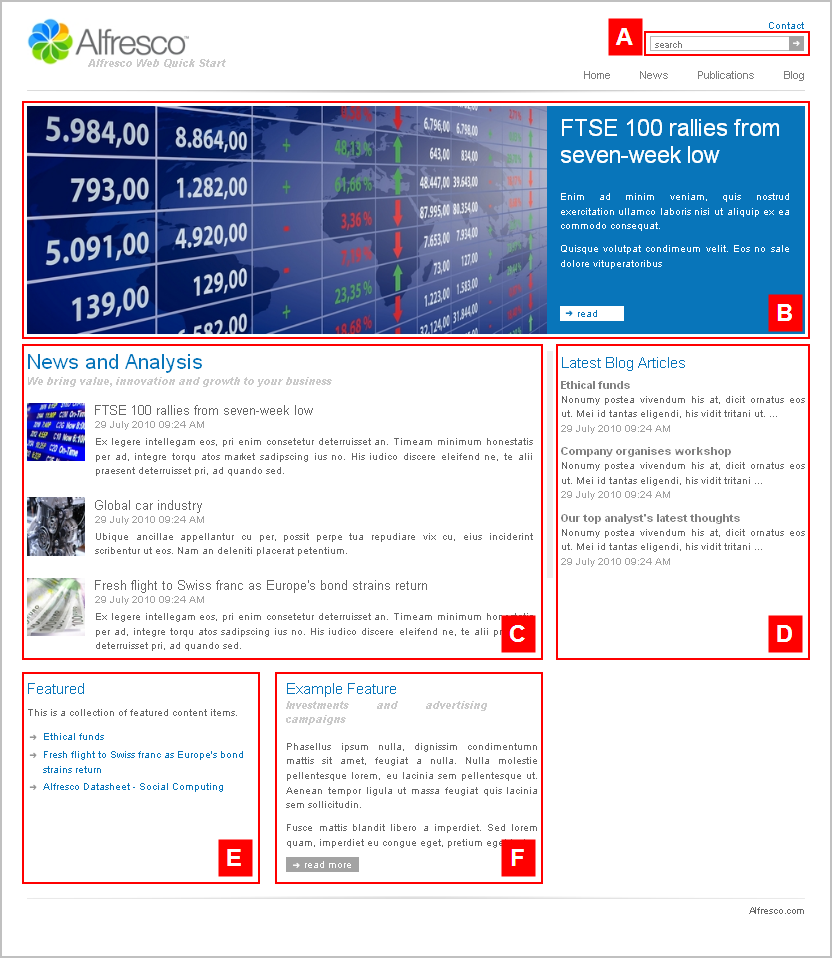

# homepage

The section **Alfresco Quick Start \> Quick Start Editorial \> root** has the template mapping `ws:indexPage=homepage`.

This is the website Home page template. It features a carousel with four distinct regions beneath. This template page has a two column layout.

View the Home page on the Web Quick Start website to see a rendering of the `homepage` template.

|A|Component: `/search/box`This component displays a site-wide search box.

|
|B|Component: `/carousel/slideshow`This component displays a wide image slideshow.

The content is populated from:

**Quick Start Editorial \> root \> collections \> news.featured**This is a static asset collection.

|
|C|Component: `/list/wide`This component displays a wide list with thumbnail images.

The content is populated from:

**Quick Start Editorial \> root \> collections \> news.top**This is a static asset collection.

|
|D|Component: `/list/narrow`This component displays a narrow list of articles with a description that is truncated to 100 characters.

The content is populated from:

**Quick Start Editorial \> root \> collections \> blogs.latest**This is a dynamic asset collection.

|
|E|Component: `/list/links`This component displays a list of links to articles.

The content is populated from:

**Quick Start Editorial \> root \> collections \> featured.links**This is a static asset collection.

|
|F|Component: `/content/narrow`This component renders an asset stored in the repository. On this page, it is configured to render **Quick Start Editorial \> root \> feature.html**.

|

Other content of note on the Home page:

-   The Alfresco logo in the header is the asset **logo.jpg** in **Quick Start Editorial \> root**.
-   The label **Alfresco Web Quick Start** beneath the Alfresco logo is the Title property of the folder **Quick Start Editorial** \(or **Quick Start Live**\).

**Parent topic:**[Templates](../references/qs-ref-templates.md)

